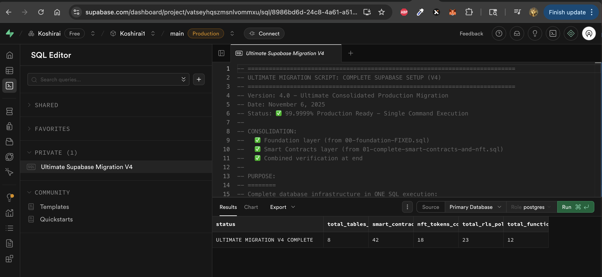
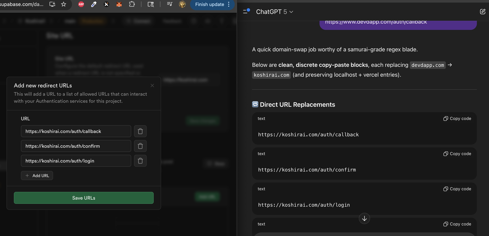
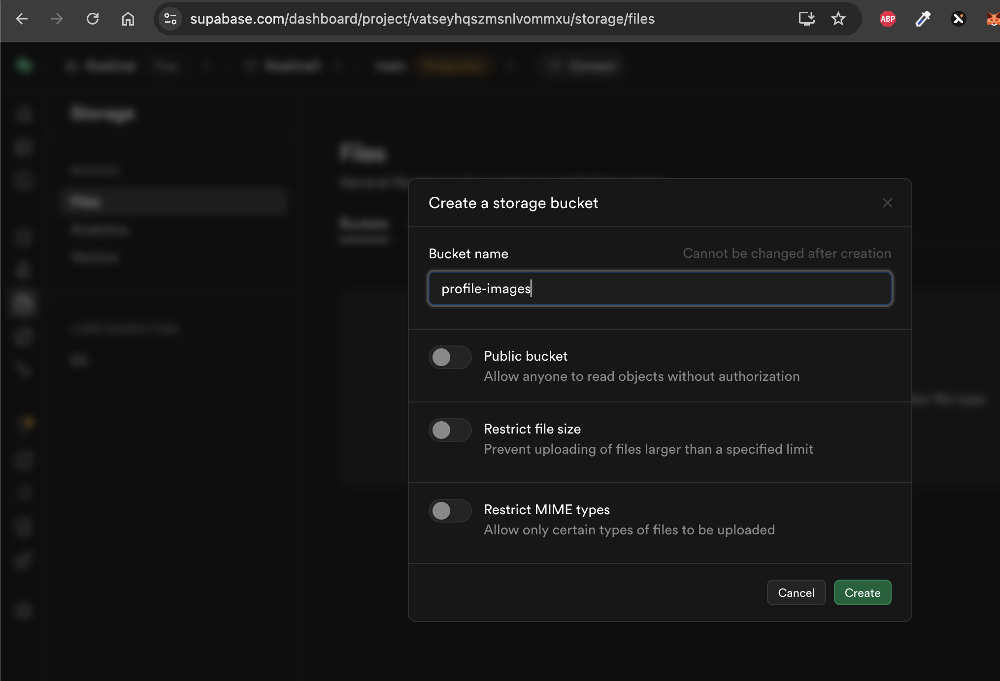
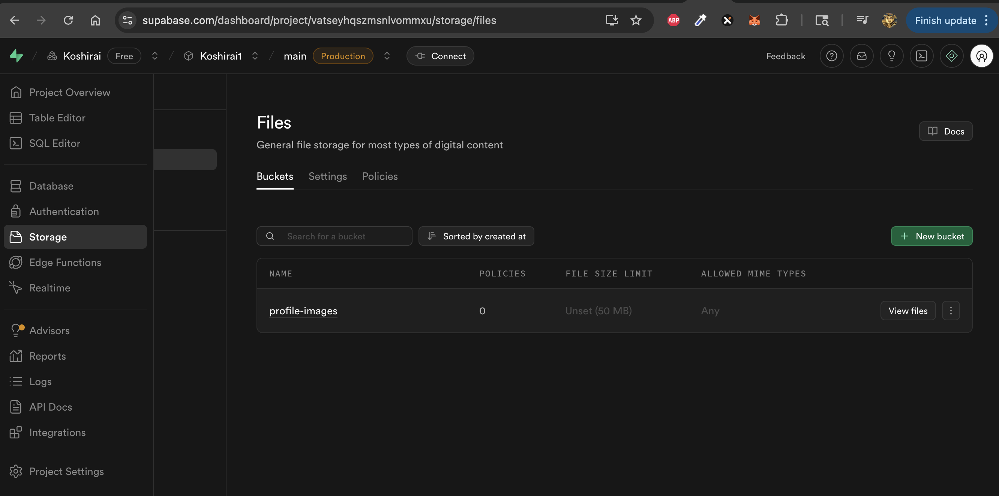

# 🚀 EVM Web3 dApp - AI Agent Setup Guide

> **Production-ready Web3 dApp with authentication, wallet management, and EVM network support powered by Coinbase Developer Platform**

This starter kit provides enterprise-grade Web3 infrastructure with Coinbase Developer Platform integration for wallet management and smart contract deployment on EVM networks. Includes user authentication, NFT contract deployment, and multi-chain EVM integration.

## ⚡ Critical Setup Requirements

### 🔑 Required Accounts & Services
- **Supabase Account** - PostgreSQL database with Row Level Security
- **Vercel Account** - Deployment and hosting platform
- **Coinbase Developer Platform Account** - Wallet management and smart contract deployment

### 🗄️ Supabase Database Setup

**Create new Supabase project with following configuration:**
- Project name: Your application identifier
- Strong database password
- Region: Closest to target users

**Execute database migration:**
- Access SQL Editor in Supabase dashboard
- Execute complete migration script: `scripts/master/00-ULTIMATE-MIGRATION.sql`
- Verify "ULTIMATE MIGRATION V4 COMPLETE" confirmation



**Result**: Fully configured PostgreSQL database with Row Level Security, user tables, wallet tables, and NFT contract tracking.

### 🔑 Critical Environment Configuration

**Required Environment Variables:**

```bash
# Supabase Database Access
NEXT_PUBLIC_SUPABASE_URL=https://your-project-ref.supabase.co
NEXT_PUBLIC_SUPABASE_PUBLISHABLE_OR_ANON_KEY=your-anon-key-jwt
SUPABASE_SERVICE_ROLE_KEY=your-service-role-jwt

# Application URLs
NEXT_PUBLIC_APP_URL=https://your-deployed-app.vercel.app

# Coinbase Developer Platform (CDP) - Wallet Management
CDP_API_KEY_ID=your-cdp-api-key-identifier
CDP_API_KEY_SECRET=your-cdp-api-key-secret
CDP_WALLET_SECRET=your-cdp-wallet-secret

# Deployer Wallet - Smart Contract Deployment
DEPLOYER_PRIVATE_KEY=0xyour-64-character-hex-private-key
NEXT_PUBLIC_DEPLOYER_ADDRESS=0xyour-40-character-wallet-address
```

**Security Requirements:**
- `CDP_API_KEY_SECRET` and `DEPLOYER_PRIVATE_KEY` must never be committed to version control
- Use separate keys for development and production environments
- Implement proper key rotation policies

### 📧 Authentication Configuration

**Supabase Auth Setup Requirements:**

- **Email Templates**: Configure signup confirmation template with the following HTML:

```html
<h2>🎉 Welcome to DevDapp!</h2>
<p>Thanks for signing up! Click the button below to confirm your email and start using DevDapp:</p>

<div style="text-align: center; margin: 30px 0;">
  <a href="{{ .SiteURL }}/auth/confirm?token_hash={{ .TokenHash }}&type=signup&next=/protected/profile"
     style="display: inline-block; padding: 15px 30px; background: linear-gradient(135deg, #0070f3 0%, #0051cc 100%); color: white; text-decoration: none; border-radius: 8px; font-family: -apple-system, BlinkMacSystemFont, 'Segoe UI', Roboto, sans-serif; font-weight: 600; font-size: 16px; box-shadow: 0 4px 12px rgba(0, 112, 243, 0.3);">
    ✅ Confirm Email & Start Using DevDapp
  </a>
</div>

<!-- PKCE-Compatible Email Confirmation URL -->
<a href="{{ .SiteURL }}/auth/confirm?code={{ .Token }}&next=/protected/profile">
  ✅ Confirm Email & Start Using DevDapp
</a>

<div style="background: #f0f9ff; padding: 20px; border-radius: 8px; border-left: 4px solid #0ea5e9; margin: 25px 0;">
  <h3 style="margin: 0 0 10px 0; color: #0c4a6e; font-size: 16px;">🚀 What you'll get access to:</h3>
  <ul style="margin: 0; padding-left: 20px; color: #0c4a6e;">
    <li>🏦 Create and manage crypto wallets</li>
    <li>💰 Send and receive USDC transfers</li>
    <li>🔗 Connect to multiple blockchain networks</li>
    <li>📊 Track your portfolio and transactions</li>
    <li>🛡️ Enterprise-grade security</li>
  </ul>
</div>

<p style="margin-top: 30px; padding-top: 20px; border-top: 1px solid #e0e0e0;">
  <strong>Backup Link:</strong> If the button doesn't work, copy and paste this link:
</p>
<p style="word-break: break-all; background: #f8f9fa; padding: 10px; border-radius: 4px; font-family: monospace; font-size: 12px;">
  {{ .SiteURL }}/auth/confirm?token_hash={{ .TokenHash }}&type=signup&next=/protected/profile
</p>

<div style="margin-top: 30px; padding: 15px; background: #fff3cd; border-left: 4px solid #ffc107; border-radius: 4px;">
  <p style="margin: 0; font-size: 14px;">
    <strong>⏰ Important:</strong> This link will expire in 24 hours for security.
  </p>
</div>

<p style="margin-top: 20px; font-size: 13px; color: #666;">
  If you didn't create an account, you can safely ignore this email.
</p>

<div style="margin-top: 40px; padding-top: 20px; border-top: 1px solid #e0e0e0; text-align: center; font-size: 12px; color: #888;">
  <p>DevDapp • <a href="https://devdapp.com" style="color: #0070f3;">devdapp.com</a></p>
</div>
```

- **Site URL**: Set to production Vercel deployment URL
- **Redirect URLs**:
  - `https://your-app.vercel.app/auth/callback`
  - `https://your-app.vercel.app/protected/profile`
  - Include local development URL during development



**Result**: Secure email-based authentication with automatic user profile creation.

### 🪣 Supabase Storage Configuration

**Create private storage bucket:**
- Bucket name: `profile-images`
- Access: Private (not public)
- File size limit: 5MB maximum





**Result**: Secure file storage for user profile images with Row Level Security.

### 🚀 Vercel Deployment Configuration

**Environment Variables Required in Vercel:**

- **Supabase Configuration:**
  - `NEXT_PUBLIC_SUPABASE_URL`
  - `NEXT_PUBLIC_SUPABASE_PUBLISHABLE_OR_ANON_KEY`
  - `SUPABASE_SERVICE_ROLE_KEY`
- **Application Configuration:**
  - `NEXT_PUBLIC_APP_URL`
- **Coinbase Developer Platform (CDP):**
  - `CDP_API_KEY_ID`
  - `CDP_API_KEY_SECRET`
  - `CDP_WALLET_SECRET`
- **NFT Deployment (Deployer Wallet):**
  - `DEPLOYER_PRIVATE_KEY`
  - `NEXT_PUBLIC_DEPLOYER_ADDRESS`

**Security Configuration:**
- Set `CDP_API_KEY_SECRET` and `DEPLOYER_PRIVATE_KEY` for Production environment only
- Use separate, limited-permission keys for production deployment
- Enable 2FA on Vercel account

**Result**: Live Web3 dApp with all EVM features and wallet management enabled.

### ✅ System Validation Requirements

**Core Functionality Verification:**

- **Authentication Flow**: Email signup → confirmation → profile access
- **User Profiles**: Create, edit, and save user data with image uploads
- **EVM Network Access**: All blockchain pages load and display network information
- **Wallet Management**: CDP wallet creation and management interfaces functional
- **NFT Deployment**: Smart contract deployment interface accessible

**Expected System State**: Fully operational Web3 dApp with authenticated users, wallet management, and EVM network connectivity.

## 🛠️ Coinbase Developer Platform (CDP) Configuration

**API Keys Setup:**
- Create CDP account at [portal.cdp.coinbase.com](https://portal.cdp.coinbase.com/)
- Generate API key with Read/Write permissions
- Securely store API Key ID and Secret


**Deployer Wallet Creation:**
- Create dedicated wallet in CDP dashboard for NFT contract deployment
- Target network: Base (or preferred EVM network)
- Retrieve and securely store:
  - Wallet address (0x... format)
  - Private key (64-character hex string)
- Fund wallet with sufficient ETH for gas fees (0.1-1 ETH recommended)

**Environment Integration:**
- Configure all CDP credentials in environment variables
- Implement proper key security and rotation policies
- Separate development and production key sets

**Critical Security Notes:**
- Private keys never committed to version control
- Environment-specific key management
- Regular key rotation implemented

---

## 🏗️ Architecture Overview

### What You Get

- **🔐 Authentication System** - Email signup/login with secure confirmation
- **👤 User Profiles** - Rich profiles with automatic database creation
- **💼 Wallet Management** - Coinbase Developer Platform integration for creating and managing EVM wallets
- **🪙 NFT Contract Deployment** - Deploy ERC721 NFT smart contracts to any EVM network
- **🌐 Multi-Chain EVM Support** - Native support for all EVM-compatible networks:
  - **Base** - Coinbase's Layer 2 network
  - **Avalanche (C-Chain)** - Fast, low-cost EVM network
  - **Ethereum** - Mainnet and testnets (Sepolia, Goerli)
  - **Polygon** - Scaling solution with EVM compatibility
  - **Optimism & Arbitrum** - Layer 2 rollup networks
  - **And 100+ other EVM chains** - Any network supporting Ethereum RPC
- **🎨 Smart Contract Management** - Deploy, verify, and track contracts
- **🛡️ Enterprise Security** - Row-level security and input validation
- **📱 Mobile-First Design** - Responsive across all devices
- **🚀 Production Infrastructure** - Scalable hosting on Vercel

### Technical Stack

- **Frontend**: Next.js 15 with React 19 and TypeScript
- **Database**: Supabase PostgreSQL with Row Level Security
- **Authentication**: Supabase Auth with email verification
- **Wallet Management**: Coinbase Developer Platform SDK
- **Smart Contracts**: ERC721 NFT standards with Hardhat deployment
- **EVM Interaction**: Ethers.js and Web3.js for blockchain calls
- **Deployment**: Vercel with automatic CI/CD
- **Styling**: Tailwind CSS with dark/light mode support

---

## 🐛 Critical System Issues & Resolutions

**Database Connectivity:**
- Validate all Supabase environment variables
- Confirm database migration completed successfully
- Check Supabase project health status

**Authentication Failures:**
- Verify Supabase callback URL configuration
- Confirm email template settings
- Validate NEXT_PUBLIC_APP_URL matches deployment domain

**Web3 Integration Issues:**
- Verify CDP API keys are active and have correct permissions
- Confirm deployer wallet has sufficient funds
- Check EVM network connectivity

**Deployment Failures:**
- Validate all required environment variables configured in Vercel
- Confirm build process completes without errors
- Check for missing dependencies or configuration conflicts

---

## 📋 System Extension Capabilities

**Core Web3 Features:**
- NFT contract deployment and management via deployer wallet
- Multi-EVM network expansion (Base, Ethereum, Polygon, Avalanche, etc.)
- Advanced DeFi integrations and staking mechanisms
- Cross-chain bridge implementations

**Infrastructure Scaling:**
- Performance optimization and gas cost management
- Enhanced monitoring and analytics integration
- Load balancing and database scaling strategies

## 🔒 Production Security Requirements

**Key Management:**
- Implement regular CDP API key rotation
- Separate development and production key environments
- Secure private key storage with hardware security modules

**Operational Security:**
- Test all smart contracts on testnets before mainnet deployment
- Maintain minimal necessary funds in deployer wallets
- Enable 2FA on all service accounts (Coinbase, Vercel, Supabase)
- Implement comprehensive transaction monitoring

**Dependency Management:**
- Regular security updates for all packages
- Automated vulnerability scanning integration
- Dependency version pinning and audit processes

---

**🎉 System Ready**: Enterprise-grade EVM Web3 dApp with secure authentication, wallet management, and NFT deployment capabilities operational.

*AI Agent Configuration Complete: Full Web3 infrastructure deployed and secured.*
