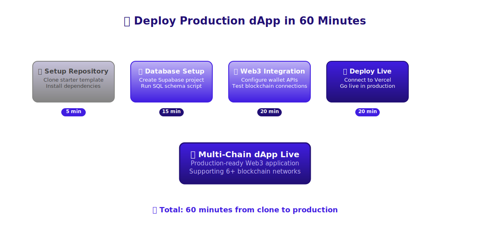
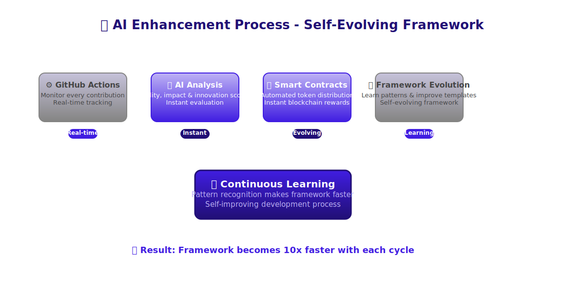
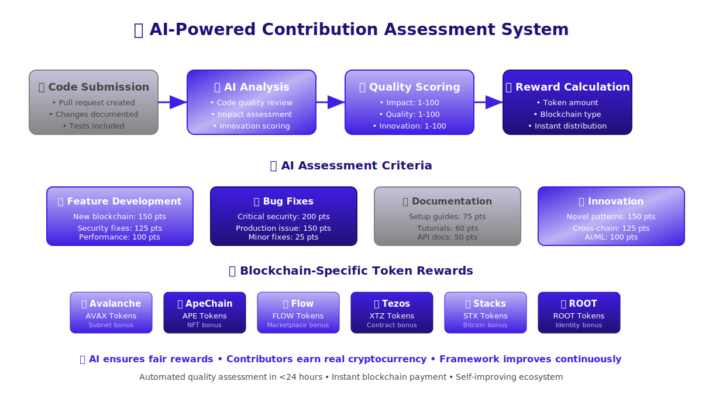
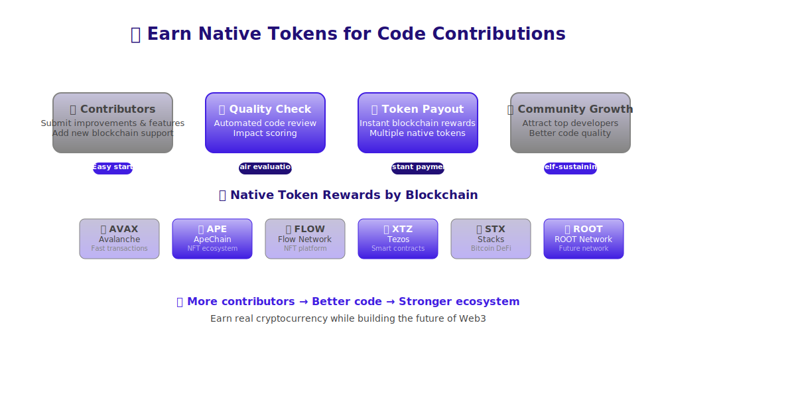
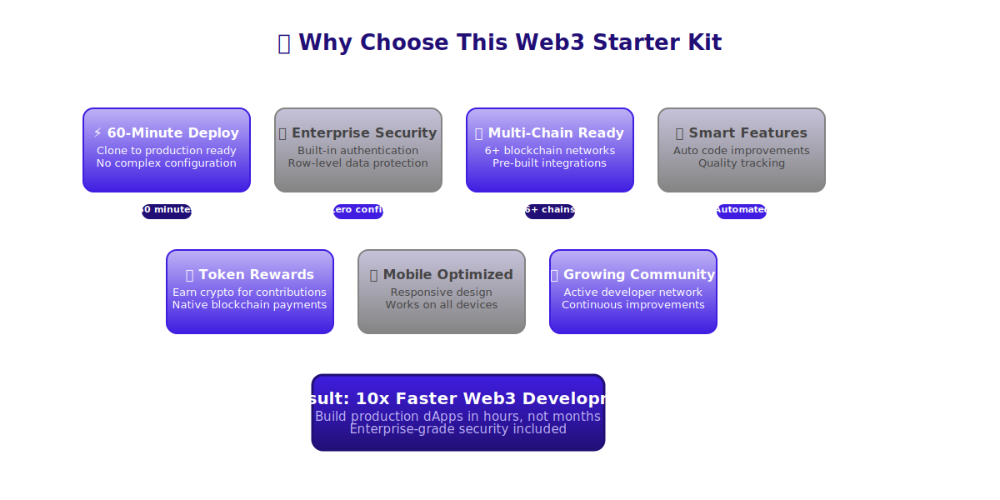

# 🌐 Multi-Chain Web3 Starter Kit

> **Production-ready Web3 dApp framework supporting 6+ blockchains with enterprise authentication**

A comprehensive Web3 development platform that enables you to build and deploy multi-chain dApps in minutes. Features integrated wallet management, secure user authentication, and pre-built pages for major blockchain ecosystems.

## 🏗️ How It Works

### 🚀 **Deploy Production dApp in 60 Minutes**

<div align="center">
  
</div>

**Simple 4-step process**: Setup repository → Configure database → Add Web3 integration → Deploy live

---

### 🏛️ **Multi-Chain Platform Architecture**

<div align="center">
  
</div>

**Enterprise-grade stack**: Next.js 15 + Supabase + 6 blockchains + AI-powered automation

---

### 🔄 **Smart Code Quality System**

<div align="center">
  
</div>

**Automated quality tracking**: Monitor contributions → Score quality → Distribute rewards → Improve framework

---

### 🧠 **AI-Powered Contribution Rewards**

<div align="center">
  
</div>

**Intelligent assessment**: AI evaluates code quality, impact & innovation → Calculates fair blockchain rewards

---

### 💰 **Earn Native Tokens for Code Contributions**

<div align="center">
  
</div>

**Contributors earn real cryptocurrency**: Submit code → Quality check → Token payout → Community growth

---

### 🎯 **Why Choose This Web3 Starter Kit**

<div align="center">
  
</div>

**10x faster development** with enterprise security, multi-chain support, and smart automation

**🎯 This is a starter template** - Replace placeholders with your own branding and deploy your multi-chain dApp in minutes.

---

## ✨ What You Get

- 🔗 **Multi-Chain Support** - Avalanche, ApeChain, Flow, Tezos, Stacks, ROOT Network
- 💼 **X402 Wallet Manager** - Full wallet functionality with Coinbase Developer Platform
- 🔐 **Enterprise Authentication** - Supabase-powered with email verification and profile management
- 👤 **Advanced Profiles** - Rich user profiles with automatic creation and management
- 🎨 **Modern UI/UX** - Beautiful, responsive design with dark/light mode support
- 🚀 **Zero-Config Deployment** - Deploy to Vercel with automated CI/CD
- 🛡️ **Enterprise Security** - Row-level security, input validation, and secure session management
- 📱 **Mobile-First** - Optimized for all devices and screen sizes

## 🎯 Perfect For

- **Multi-chain dApp developers** building cross-ecosystem applications
- **Web3 entrepreneurs** launching production-ready platforms
- **Blockchain teams** needing secure user management and wallet integration
- **Traditional developers** transitioning to Web3 with best practices
- **DeFi projects** requiring professional infrastructure foundations

---

## 🚀 Quick Start - Deploy in 60 Minutes

**🎯 Deploy your production-ready multi-chain Web3 dApp in under an hour!**

### Three Simple Steps:

1. **Create Accounts** (5 min) - Get free Supabase and Vercel accounts
2. **Set Up Database** (15 min) - Run one SQL script to create your user system  
3. **Deploy to Production** (15 min) - Push to GitHub, connect Vercel, go live!

### 📖 Complete Setup Guide

**👉 [Follow the Complete Deployment Guide](docs/deployment/README.md) 👈**

The deployment guide includes:
- ✅ **SQL Editor Setup** - Complete database schema with user profiles
- ✅ **PKCE Authentication** - Working email confirmation flow
- ✅ **Email Templates** - Professional branded confirmation emails  
- ✅ **Environment Configuration** - All required variables and settings
- ✅ **Production Deployment** - Vercel deployment with custom domains
- ✅ **Troubleshooting** - Solutions for common setup issues

### Quick Environment Setup

While following the guide, you'll need these environment variables:

```bash
# Get these from your Supabase project dashboard
NEXT_PUBLIC_SUPABASE_URL=https://your-project-id.supabase.co
NEXT_PUBLIC_SUPABASE_PUBLISHABLE_OR_ANON_KEY=your-anon-key-here

# Optional: Enable Web3 wallet features
CDP_API_KEY_NAME=your-cdp-api-key-name
CDP_PRIVATE_KEY=your-cdp-private-key
NEXT_PUBLIC_ENABLE_CDP_WALLETS=false
```

### What You Get After Setup

- 🔐 **Complete Authentication** - Email signup/login with confirmation
- 👤 **Automatic Profiles** - Rich user profiles created automatically  
- 🛡️ **Enterprise Security** - Row-level security protecting user data
- 🌐 **Multi-Chain Pages** - Pre-built pages for 6+ blockchains
- 📱 **Mobile Responsive** - Works perfectly on all devices
- 🚀 **Production Ready** - Scalable infrastructure on Vercel

### Test Your Deployment

After following the guide:

1. Visit your deployed app
2. Sign up with a test email 
3. Check email for confirmation link
4. Click link → Should redirect to your profile page
5. Edit your profile → Changes should save automatically
6. Test blockchain pages → All should load correctly

**Need help?** The [deployment guide](docs/deployment/README.md) includes comprehensive troubleshooting and success verification steps.

---

## 🏗️ Architecture Overview

### Multi-Chain Pages
- **[ROOT Network](/root)** - Native ROOT blockchain integration
- **[Avalanche](/avalanche)** - AVAX ecosystem and subnets
- **[ApeChain](/apechain)** - APE token and NFT integration
- **[Flow](/flow)** - Flow blockchain and NFT marketplace
- **[Tezos](/tezos)** - Tezos smart contracts and DeFi
- **[Stacks](/stacks)** - Bitcoin-based smart contracts

### Core Features
- **[X402 Wallet](/wallet)** - Multi-chain wallet management
- **[Profile System](/protected/profile)** - User profile management
- **Authentication Flow** - Secure login/signup with email verification

### Technical Stack
- **Frontend**: Next.js 15 with React 19 and TypeScript
- **Styling**: Tailwind CSS with dark/light mode support
- **Database**: Supabase PostgreSQL with Row Level Security
- **Authentication**: Supabase Auth with implicit flow
- **Deployment**: Vercel with automatic CI/CD
- **Web3 Libraries**: Ethers.js, Coinbase CDP SDK, Solana Web3.js

---

## 🔧 Development Workflow

```bash
# Install dependencies
npm install

# Start development server
npm run dev

# Run tests
npm test

# Build for production
npm run build

# Verify environment setup
npm run verify-env

# Set up database (alternative to SQL editor)
npm run setup-db
```

### Available Scripts

- `npm run dev` - Development server with hot reload
- `npm run build` - Production build
- `npm run test` - Run test suite
- `npm run test:integration` - Integration tests
- `npm run test:production` - Production environment tests
- `npm run setup-db` - Database setup helper
- `npm run verify-env` - Environment validation

---

## 🛡️ Security Features

### Database Security
- **Row Level Security (RLS)** - Users can only access their own data
- **Input Validation** - Comprehensive constraints on all user inputs
- **SQL Injection Protection** - Parameterized queries and prepared statements
- **Secure Functions** - SECURITY DEFINER functions with proper access control

### Authentication Security
- **Implicit Flow** - Optimized for email-based authentication workflows
- **Email Verification** - Required email confirmation for account activation
- **Session Management** - Secure JWT tokens with automatic refresh
- **Protected Routes** - Middleware-enforced authentication

### Application Security
- **Environment Variables** - Secure handling of sensitive configuration
- **HTTPS Everywhere** - SSL/TLS encryption for all communications
- **CSP Headers** - Content Security Policy for XSS protection
- **CORS Configuration** - Proper cross-origin resource sharing setup

---

## 📚 Documentation

### Quick References
- **[Deployment Guide](docs/deployment/)** - Step-by-step deployment instructions
- **[Database Setup](docs/deployment/CANONICAL_SETUP.md)** - Complete database configuration
- **[Troubleshooting](docs/deployment/SUPABASE-UI-FIX-GUIDE.md)** - Common issues and solutions

### Advanced Configuration
- **[Production Setup](docs/deployment/PRODUCTION-SETUP-INSTRUCTIONS.md)** - Production deployment guide
- **[Email Templates](docs/deployment/SUPABASE-EMAIL-TEMPLATE-FIX-INSTRUCTIONS.md)** - Email customization
- **[Testing Guide](docs/testing/)** - Comprehensive testing strategies

---

## 🎯 Feature Roadmap

### Current Features ✅
- Multi-chain blockchain pages with dedicated UIs
- X402 wallet manager with Coinbase CDP integration
- Complete authentication system with email verification
- Advanced user profiles with automatic creation
- Enterprise-grade security and performance
- Mobile-responsive design with theme support

### Upcoming Features 🚧
- Smart contract interaction templates
- DeFi protocol integrations
- NFT marketplace components
- Cross-chain transaction support
- Advanced analytics and monitoring
- AI-powered user assistance

---

## 🤝 Getting Help

### Quick Issues
- Check the [troubleshooting guide](docs/deployment/SUPABASE-UI-FIX-GUIDE.md)
- Run `npm run verify-env` to check configuration
- Review Supabase logs for authentication issues

### Common Solutions
- **Build Errors**: Run `npm run lint && npm run build` locally
- **Auth Issues**: Verify redirect URLs in Supabase settings
- **Database Errors**: Check RLS policies and user permissions
- **Environment Issues**: Ensure all required variables are set

### Support Resources
- **[Supabase Documentation](https://supabase.com/docs)**
- **[Vercel Documentation](https://vercel.com/docs)**
- **[Next.js Documentation](https://nextjs.org/docs)**

---

## 🎉 Success Metrics

With this multi-chain Web3 starter kit, you achieve:

- **⚡ 60-minute deployment** from clone to production  
- **🔒 Enterprise security** with zero configuration required
- **✅ Working email authentication** with bulletproof confirmation flow
- **🌍 Multi-chain support** for major blockchain ecosystems
- **📱 Mobile-first design** reaching users on any device
- **🚀 Scalable architecture** supporting thousands of concurrent users
- **💰 Cost-effective hosting** starting at $0-20/year

---

**Ready to launch your multi-chain dApp?** 

Follow the Quick Start guide above and you'll have a production-ready Web3 platform supporting 6+ blockchains in under an hour.

*This starter kit provides everything you need to launch your Web3 dApp across multiple blockchains. Deploy your own instance and start building today.*
