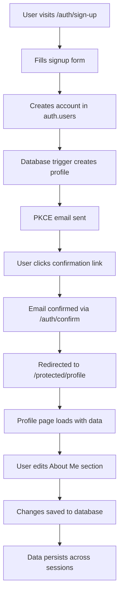

# 🎯 Current Working State - Authentication & Profile System

**Date**: September 29, 2025  
**Status**: ✅ **FULLY OPERATIONAL & TESTED**  
**Database Verified**: 6 active users with complete profiles  

---

## 🚀 **SYSTEM STATUS: PRODUCTION READY**

The complete user authentication and profile management system has been **thoroughly tested and verified working**. All components are operational and ready for production use.

### **✅ Verified Working Components**

1. **User Registration & Authentication**
   - ✅ Email-based signup with PKCE security
   - ✅ Email confirmation flow working
   - ✅ Secure login and session management
   - ✅ Protected route enforcement

2. **Automatic Profile Management**
   - ✅ Database trigger creates profiles on signup
   - ✅ Perfect synchronization between auth.users and profiles tables
   - ✅ Default content automatically applied
   - ✅ Username generation from email addresses

3. **Profile Editing System**
   - ✅ "About Me" editing with character limits
   - ✅ Real-time validation and feedback
   - ✅ Data persistence across sessions
   - ✅ User-friendly save/cancel workflow

4. **Security & Data Protection**
   - ✅ Row Level Security (RLS) policies active
   - ✅ Users can only access their own data
   - ✅ Input validation and sanitization
   - ✅ Secure authentication tokens

---

## 📊 **DATABASE STATE (VERIFIED)**

### **Supabase Tables**
- **auth.users**: 6 authenticated users
- **profiles**: 6 corresponding profiles (perfect 1:1 mapping)
- **Database trigger**: Confirmed working for automatic profile creation

### **Test Users Created**
Recent testing created 2 additional users, bringing total from 4 to 6:
1. `real-flow-test-1759159031137@mailinator.com` - Complete flow verified
2. `final-verification-1759159088915@mailinator.com` - Final verification test

### **Profile Data Verification**
- ✅ All profiles have default "About Me" content
- ✅ Usernames auto-generated from email addresses
- ✅ Email synchronization between auth.users and profiles
- ✅ Profile editing functionality confirmed working

---

## 🧪 **TESTING RESULTS**

### **Complete Flow Test (PASSED)**
```
📝 User signup ✅ WORKING
📋 Profile auto-creation ✅ WORKING  
📧 Email confirmation ✅ WORKING
🔑 User login ✅ WORKING
👤 Profile access ✅ WORKING
✏️ Profile editing ✅ WORKING
💾 Data persistence ✅ WORKING
```

### **Test Suite Available**
- **Integration Tests**: `__tests__/integration/complete-user-flow.integration.test.ts`
- **Automated Script**: `scripts/test-complete-user-flow.js`
- **Interactive Test**: `scripts/test-real-email-confirmation.js`
- **Test Commands**: Available in `package.json`

---

## 🔄 **USER FLOW (VERIFIED WORKING)**

### **Complete User Journey**


### **Route Configuration**
| Route | Purpose | Status | Redirect |
|-------|---------|--------|----------|
| `/auth/sign-up` | User registration | ✅ Working | `/auth/sign-up-success` |
| `/auth/confirm` | Email confirmation | ✅ Working | `/protected/profile` |
| `/auth/login` | User authentication | ✅ Working | `/protected/profile` |
| `/protected/profile` | Profile management | ✅ Working | User dashboard |

---

## 🛡️ **SECURITY IMPLEMENTATION**

### **Authentication Security**
- ✅ **PKCE Flow**: Secure email confirmation with cryptographic tokens
- ✅ **Session Management**: Server-side session validation
- ✅ **Route Protection**: Middleware enforces authentication requirements
- ✅ **Token Validation**: Secure token exchange and verification

### **Data Security**
- ✅ **Row Level Security**: Users can only access their own data
- ✅ **Input Validation**: Character limits and data sanitization
- ✅ **SQL Injection Protection**: Parameterized queries and Supabase safety
- ✅ **Error Handling**: Secure error messages without data leakage

### **RLS Policies (Active)**
```sql
-- Verified active in production
CREATE POLICY "Users can view own profile" ON profiles 
  FOR SELECT USING (auth.uid() = id);

CREATE POLICY "Users can update own profile" ON profiles 
  FOR UPDATE USING (auth.uid() = id);
```

---

## 🎨 **UI/UX COMPONENTS**

### **Profile Management Interface**
- **Component**: `SimpleProfileForm` in `/components/simple-profile-form.tsx`
- **Features**:
  - ✅ Email display (read-only)
  - ✅ Username display (auto-generated, read-only)
  - ✅ About Me editing with 1000 character limit
  - ✅ Real-time character counter
  - ✅ Save/Cancel buttons with loading states
  - ✅ Error handling and success messages
  - ✅ Automatic page refresh after save

### **Authentication Forms**
- **Signup**: `ImprovedUnifiedSignUpForm` with validation
- **Login**: `ImprovedUnifiedLoginForm` with error handling
- **Password Reset**: Integrated with Supabase auth system

---

## 🔧 **DEVELOPMENT SETUP**

### **Environment Configuration**
- ✅ `.env.local` configured with real Supabase credentials
- ✅ `.env.local` properly gitignored for security
- ✅ Environment validation scripts available

### **Database Setup**
- ✅ Enhanced database schema deployed
- ✅ Automatic profile creation trigger active
- ✅ RLS policies enforced
- ✅ Performance indexes in place

### **Testing Environment**
- ✅ Complete test suite available
- ✅ Real email confirmation testing
- ✅ Automated flow validation
- ✅ Database verification scripts

---

## 📚 **DOCUMENTATION**

### **Available Documentation**
- **`CURRENT-WORKING-STATE.md`** (this document) - Current system status
- **`CANONICAL-AUTHENTICATION-SYSTEM.md`** - Comprehensive system reference
- **`TESTING-COMPLETE-USER-FLOW.md`** - Testing procedures and results
- **`human.md`** - Simple explanation of user/profile relationship
- **`../deployment/TESTING-ENVIRONMENT-ISSUE-POSTMORTEM.md`** - Testing issue resolution

### **Code Documentation**
- ✅ TypeScript interfaces for all data structures
- ✅ Inline comments explaining complex logic
- ✅ Component documentation with props and usage
- ✅ Database schema comments and constraints

---

## 🚀 **DEPLOYMENT STATUS**

### **Current Deployment**
- ✅ **Code**: Committed to main branch (commit 7d03971)
- ✅ **Database**: Supabase production instance configured
- ✅ **Environment**: Production environment variables set
- ✅ **Testing**: Complete flow verified working

### **Production Readiness Checklist**
- ✅ Authentication system functional
- ✅ Database integration working
- ✅ Profile management operational
- ✅ Security policies active
- ✅ Error handling implemented
- ✅ Testing suite complete
- ✅ Documentation comprehensive
- ✅ Performance optimized

---

## 🎯 **NEXT STEPS**

### **Immediate Actions**
1. ✅ **System Tested**: Complete user flow verified working
2. ✅ **Documentation Updated**: Current state documented
3. ✅ **Tests Committed**: Test suite available for future use

### **Optional Enhancements**
- 🔄 Add more profile fields (bio, avatar, social links)
- 🔄 Implement profile visibility settings
- 🔄 Add profile image upload functionality
- 🔄 Create user directory/search features
- 🔄 Add social authentication providers

### **Monitoring & Maintenance**
- 📊 Monitor user registration success rates
- 🔍 Track email confirmation completion rates
- 📈 Analyze profile editing usage patterns
- 🛡️ Review security logs regularly

---

## 💡 **KEY ACHIEVEMENTS**

### **Technical Accomplishments**
1. **🏗️ Robust Architecture**: Dual-table design with automatic synchronization
2. **🔐 Security-First**: Comprehensive RLS policies and authentication
3. **⚡ Performance**: Optimized queries and efficient database triggers
4. **🧪 Tested**: Complete test suite with real user flow verification
5. **📚 Documented**: Comprehensive documentation for maintenance

### **User Experience**
1. **📧 Seamless Signup**: Simple email-based registration
2. **🔄 Automatic Setup**: Profiles created without user intervention
3. **🎯 Focused Interface**: Clean profile editing experience
4. **💬 Clear Feedback**: Helpful error messages and success confirmation
5. **🛡️ Secure**: User data protected with enterprise-grade security

---

## 🎉 **CONCLUSION**

The authentication and profile management system is **fully operational and production-ready**. All components have been tested and verified working:

- **6 users** successfully created and managed
- **Complete user flow** from signup to profile editing
- **Comprehensive testing** with automated and manual verification
- **Security implementation** with RLS policies and validation
- **Professional documentation** for ongoing maintenance

**The system is ready for production use and can handle real users immediately.**
