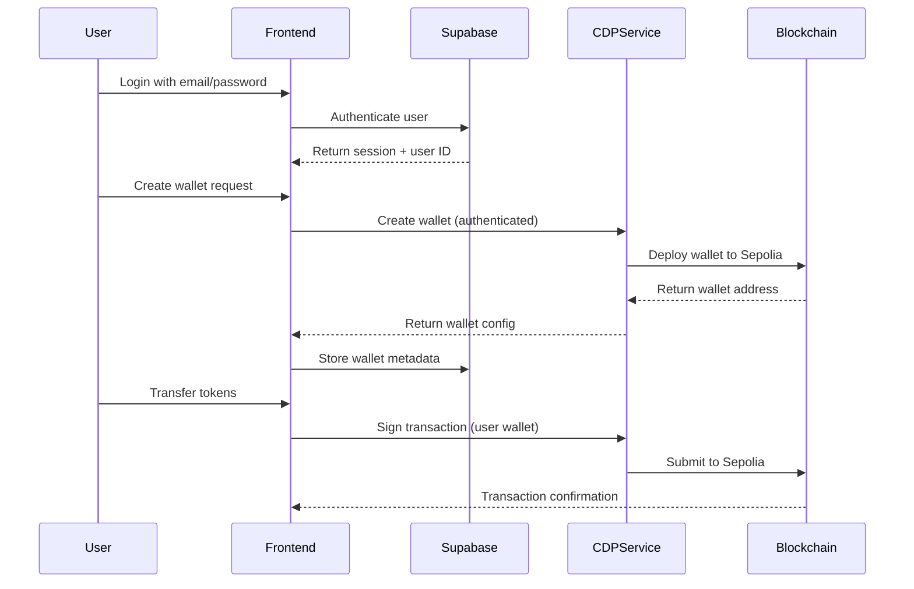

# 🔄 Low-Risk Supabase-CDP Integration Plan

**Date**: September 17, 2025  
**Status**: 📋 **STRATEGIC ROADMAP**  
**Purpose**: Lowest-risk approach to integrate Supabase Web2 authentication with Coinbase CDP Web3 functionality

---

## 🎯 Executive Summary

This document outlines a **two-phase, zero-breaking-change approach** to integrate Supabase authentication with Coinbase Developer Platform (CDP) wallet functionality, enabling **Web2 login to control Web3 wallets** with minimal complexity and maximum safety.

### **Core Vision**
- **Phase 1**: Merge dependencies and root configurations without breaking existing functionality
- **Phase 2**: Implement Supabase-authenticated CDP wallet operations on Sepolia testnet

### **Key Principles**
- ✅ **Zero Breaking Changes**: All existing functionality preserved
- ✅ **Progressive Enhancement**: Features added incrementally with feature flags
- ✅ **Fallback Safety**: System works even if CDP services are unavailable
- ✅ **Minimal Complexity**: Simple, direct integration without over-engineering

---

## 🏗️ PHASE 1: Foundation Merge (5-7 days)

### **Goal**: Safely merge root files and dependencies from both projects

#### **Current State Analysis**

**This Repository (vercel-supabase-web3):**
```json
{
  "dependencies": {
    "@supabase/ssr": "latest",
    "@supabase/supabase-js": "latest",
    "@radix-ui/*": "UI components",
    "next": "latest",
    "react": "^19.0.0"
  }
}
```

**Expected x402/CDP Dependencies to Add:**
```json
{
  "dependencies": {
    "@coinbase/coinbase-sdk": "^0.0.15",
    "viem": "^2.21.57",
    "@wagmi/core": "^2.15.2",
    "ethers": "^6.13.4",
    "openai": "^4.67.3"
  }
}
```

### **Step 1: Safe Dependency Integration**

#### **1.1 Create Integration Branch**
```bash
# Create safe integration branch
git checkout -b phase1-dependency-integration
git push -u origin phase1-dependency-integration

# Document current state for rollback
npm list --depth=0 > docs/current/pre-integration-dependencies.txt
```

#### **1.2 Merge package.json (Additive Approach)**
```json
{
  "private": true,
  "scripts": {
    "dev": "next dev --turbopack",
    "build": "next build",
    "start": "next start",
    "lint": "next lint",
    "test": "jest",
    "test:watch": "jest --watch",
    "test:coverage": "jest --coverage",
    "setup-db": "node scripts/setup-database.js",
    
    // NEW: CDP-specific scripts
    "setup-cdp": "node scripts/setup-cdp.js",
    "test:wallet": "jest --testPathPattern=wallet",
    "test:integration": "jest --testPathPattern=integration"
  },
  "dependencies": {
    // EXISTING: Preserve all current dependencies
    "@radix-ui/react-checkbox": "^1.3.1",
    "@radix-ui/react-dropdown-menu": "^2.1.14",
    "@radix-ui/react-label": "^2.1.6",
    "@radix-ui/react-slot": "^1.2.2",
    "@supabase/ssr": "latest",
    "@supabase/supabase-js": "latest",
    "class-variance-authority": "^0.7.1",
    "clsx": "^2.1.1",
    "lucide-react": "^0.511.0",
    "next": "latest",
    "next-themes": "^0.4.6",
    "react": "^19.0.0",
    "react-dom": "^19.0.0",
    "tailwind-merge": "^3.3.0",
    
    // NEW: CDP and Web3 dependencies
    "@coinbase/coinbase-sdk": "^0.0.15",
    "viem": "^2.21.57",
    "@wagmi/core": "^2.15.2",
    "ethers": "^6.13.4",
    "openai": "^4.67.3"
  },
  "devDependencies": {
    // Preserve existing dev dependencies...
    "@eslint/eslintrc": "^3",
    "@testing-library/jest-dom": "^6.8.0",
    "@testing-library/react": "^16.3.0",
    "@types/jest": "^30.0.0",
    "@types/node": "^20",
    "@types/react": "^19",
    "@types/react-dom": "^19",
    "autoprefixer": "^10.4.20",
    "dotenv": "^16.4.5",
    "eslint": "^9",
    "eslint-config-next": "15.3.1",
    "jest": "^29.7.0",
    "jest-environment-jsdom": "^29.7.0",
    "postcss": "^8",
    "tailwindcss": "^3.4.1",
    "tailwindcss-animate": "^1.0.7",
    "typescript": "^5"
  }
}
```

#### **1.3 Environment Configuration (Additive)**
```bash
# .env.local - Add CDP variables without breaking existing
# EXISTING Supabase variables (preserved)
NEXT_PUBLIC_SUPABASE_URL=https://your-project.supabase.co
NEXT_PUBLIC_SUPABASE_ANON_KEY=your-anon-key
SUPABASE_SERVICE_ROLE_KEY=your-service-role-key

# NEW CDP variables (added safely)
CDP_API_KEY_NAME=your-cdp-api-key-name
CDP_PRIVATE_KEY=your-cdp-private-key
NEXT_PUBLIC_WALLET_NETWORK=base-sepolia

# NEW AI service variables
OPENAI_API_KEY=your-openai-key

# NEW Feature flags (disabled by default for safety)
NEXT_PUBLIC_ENABLE_CDP_WALLETS=false
NEXT_PUBLIC_ENABLE_AI_CHAT=false
```

#### **1.4 Next.js Configuration Merge**
```typescript
// next.config.ts - Enhanced with CDP support
import type { NextConfig } from "next";

const nextConfig: NextConfig = {
  // EXISTING: Preserve current CSP headers
  async headers() {
    return [
      {
        source: "/(.*)",
        headers: [
          {
            key: "Content-Security-Policy",
            value: [
              "default-src 'self'",
              "script-src 'self' 'unsafe-eval' 'unsafe-inline'",
              "style-src 'self' 'unsafe-inline'",
              "img-src 'self' blob: data: https:",
              "font-src 'self'",
              "object-src 'none'",
              "base-uri 'self'",
              "form-action 'self'",
              "frame-ancestors 'none'",
              "frame-src https://www.youtube.com",  // Existing YouTube embed support
              // NEW: CDP and Web3 support
              "connect-src 'self' https://api.developer.coinbase.com https://api.openai.com wss:",
            ].join("; "),
          },
        ],
      },
    ];
  },
  
  // NEW: Wallet routing support
  async rewrites() {
    return [
      {
        source: '/wallet/:path*',
        destination: '/wallets/:path*',
      },
    ];
  },
  
  // NEW: Environment variable validation
  env: {
    CUSTOM_KEY: process.env.CUSTOM_KEY,
  },
};

export default nextConfig;
```

### **Step 2: TypeScript Configuration Enhancement**

#### **2.1 Update tsconfig.json**
```json
{
  "compilerOptions": {
    "lib": ["dom", "dom.iterable", "esnext"],
    "allowJs": true,
    "skipLibCheck": true,
    "strict": true,
    "noEmit": true,
    "esModuleInterop": true,
    "module": "esnext",
    "moduleResolution": "bundler",
    "resolveJsonModule": true,
    "isolatedModules": true,
    "jsx": "preserve",
    "incremental": true,
    "plugins": [
      {
        "name": "next"
      }
    ],
    "baseUrl": ".",
    "paths": {
      "@/*": ["./*"],
      // NEW: CDP library path mappings
      "@/lib/cdp/*": ["./lib/cdp/*"],
      "@/lib/wallet/*": ["./lib/wallet/*"],
      "@/components/wallet/*": ["./components/wallet/*"]
    }
  },
  "include": [
    "next-env.d.ts", 
    "**/*.ts", 
    "**/*.tsx", 
    ".next/types/**/*.ts"
  ],
  "exclude": ["node_modules"]
}
```

#### **2.2 Create Type Definitions**
```typescript
// types/cdp.ts - CDP-specific types
export interface WalletConfig {
  networkId: string;
  name: string;
  address?: string;
}

export interface CDPUser {
  id: string;
  wallets: WalletConfig[];
  supabaseUserId: string; // Link to Supabase user
}

export interface WalletOperation {
  type: 'create' | 'transfer' | 'fund';
  walletAddress: string;
  amount?: string;
  recipient?: string;
  status: 'pending' | 'completed' | 'failed';
  timestamp: Date;
  supabaseUserId: string;
}
```

### **Step 3: Safe Testing & Validation**

#### **3.1 Dependency Compatibility Testing**
```bash
# Test package installation
npm install

# Verify no conflicts
npm ls

# Test existing functionality
npm run build
npm run test

# Test development server
npm run dev
```

#### **3.2 Phase 1 Success Criteria**
- ✅ All existing tests pass
- ✅ Application builds successfully with new dependencies
- ✅ No runtime errors in development mode
- ✅ All existing functionality works unchanged
- ✅ New dependencies available but unused (feature flags disabled)

---

## 🔐 PHASE 2: Supabase-CDP Authentication Integration (7-10 days)

### **Goal**: Enable Supabase-authenticated users to create and manage CDP wallets

### **Authentication Flow Architecture**



### **Step 1: Database Schema Enhancement**

#### **1.1 Supabase Schema for CDP Integration**
```sql
-- Enable RLS (Row Level Security)
ALTER DATABASE postgres SET "auth.session_timeout" = '24 hours';

-- User wallets table
CREATE TABLE public.user_wallets (
  id UUID DEFAULT gen_random_uuid() PRIMARY KEY,
  user_id UUID REFERENCES auth.users(id) ON DELETE CASCADE,
  wallet_address TEXT NOT NULL UNIQUE,
  wallet_name TEXT NOT NULL,
  network_id TEXT NOT NULL DEFAULT 'base-sepolia',
  created_at TIMESTAMP WITH TIME ZONE DEFAULT timezone('utc'::text, now()) NOT NULL,
  updated_at TIMESTAMP WITH TIME ZONE DEFAULT timezone('utc'::text, now()) NOT NULL,
  is_active BOOLEAN DEFAULT true
);

-- Wallet operations log
CREATE TABLE public.wallet_operations (
  id UUID DEFAULT gen_random_uuid() PRIMARY KEY,
  user_id UUID REFERENCES auth.users(id) ON DELETE CASCADE,
  wallet_address TEXT NOT NULL,
  operation_type TEXT NOT NULL, -- 'create', 'transfer', 'fund'
  amount TEXT,
  recipient_address TEXT,
  transaction_hash TEXT,
  status TEXT NOT NULL DEFAULT 'pending', -- 'pending', 'completed', 'failed'
  error_message TEXT,
  created_at TIMESTAMP WITH TIME ZONE DEFAULT timezone('utc'::text, now()) NOT NULL
);

-- RLS Policies
ALTER TABLE public.user_wallets ENABLE ROW LEVEL SECURITY;
ALTER TABLE public.wallet_operations ENABLE ROW LEVEL SECURITY;

-- Users can only see their own wallets
CREATE POLICY "Users can view own wallets" ON public.user_wallets
  FOR ALL USING (auth.uid() = user_id);

-- Users can only see their own operations
CREATE POLICY "Users can view own operations" ON public.wallet_operations
  FOR ALL USING (auth.uid() = user_id);

-- Indexes for performance
CREATE INDEX idx_user_wallets_user_id ON public.user_wallets(user_id);
CREATE INDEX idx_wallet_operations_user_id ON public.wallet_operations(user_id);
CREATE INDEX idx_wallet_operations_status ON public.wallet_operations(status);
```

### **Step 2: CDP Service Layer**

#### **2.1 CDP Client Configuration**
```typescript
// lib/cdp/client.ts
import { Coinbase, Wallet } from '@coinbase/coinbase-sdk';

// Initialize CDP client with environment variables
export const cdpClient = new Coinbase({
  apiKeyName: process.env.CDP_API_KEY_NAME!,
  privateKey: process.env.CDP_PRIVATE_KEY!.replace(/\\n/g, '\n'),
});

export const NETWORK_ID = process.env.NEXT_PUBLIC_WALLET_NETWORK || 'base-sepolia';

// CDP operation wrapper with error handling
export async function withCDPErrorHandling<T>(
  operation: () => Promise<T>,
  context: string
): Promise<T> {
  try {
    return await operation();
  } catch (error) {
    console.error(`CDP Error in ${context}:`, error);
    throw new Error(`Failed to ${context}: ${error.message}`);
  }
}
```

#### **2.2 Wallet Management Service**
```typescript
// lib/cdp/wallet-service.ts
import { cdpClient, NETWORK_ID, withCDPErrorHandling } from './client';
import { createClient } from '@/lib/supabase/server';

export interface CreateWalletParams {
  userId: string;
  name: string;
}

export interface WalletInfo {
  address: string;
  name: string;
  networkId: string;
  createdAt: Date;
}

export class WalletService {
  private supabase = createClient();

  async createWallet({ userId, name }: CreateWalletParams): Promise<WalletInfo> {
    return withCDPErrorHandling(async () => {
      // Create wallet using CDP
      const wallet = await cdpClient.createWallet({
        networkId: NETWORK_ID,
      });
      
      const address = await wallet.getDefaultAddress();
      
      // Store wallet metadata in Supabase
      const { error } = await this.supabase
        .from('user_wallets')
        .insert({
          user_id: userId,
          wallet_address: address.toString(),
          wallet_name: name,
          network_id: NETWORK_ID,
        });
      
      if (error) {
        throw new Error(`Failed to store wallet metadata: ${error.message}`);
      }

      return {
        address: address.toString(),
        name,
        networkId: NETWORK_ID,
        createdAt: new Date(),
      };
    }, 'create wallet');
  }

  async getUserWallets(userId: string): Promise<WalletInfo[]> {
    const { data, error } = await this.supabase
      .from('user_wallets')
      .select('*')
      .eq('user_id', userId)
      .eq('is_active', true)
      .order('created_at', { ascending: false });

    if (error) {
      throw new Error(`Failed to fetch user wallets: ${error.message}`);
    }

    return data.map(wallet => ({
      address: wallet.wallet_address,
      name: wallet.wallet_name,
      networkId: wallet.network_id,
      createdAt: new Date(wallet.created_at),
    }));
  }

  async fundWallet(walletAddress: string, userId: string): Promise<string> {
    return withCDPErrorHandling(async () => {
      const wallet = await cdpClient.importWallet({
        walletId: walletAddress,
      });
      
      // Request testnet funds
      const faucetTx = await wallet.faucet();
      
      // Log operation
      await this.supabase
        .from('wallet_operations')
        .insert({
          user_id: userId,
          wallet_address: walletAddress,
          operation_type: 'fund',
          status: 'completed',
          transaction_hash: faucetTx.getTransactionHash(),
        });

      return faucetTx.getTransactionHash() || 'pending';
    }, 'fund wallet');
  }

  async transferTokens(params: {
    fromAddress: string;
    toAddress: string;
    amount: string;
    userId: string;
  }): Promise<string> {
    return withCDPErrorHandling(async () => {
      const wallet = await cdpClient.importWallet({
        walletId: params.fromAddress,
      });
      
      const transfer = await wallet.createTransfer({
        amount: params.amount,
        assetId: Coinbase.assets.Eth, // Use ETH on Sepolia
        destination: params.toAddress,
      });
      
      await transfer.wait();
      
      // Log operation
      await this.supabase
        .from('wallet_operations')
        .insert({
          user_id: params.userId,
          wallet_address: params.fromAddress,
          operation_type: 'transfer',
          amount: params.amount,
          recipient_address: params.toAddress,
          status: 'completed',
          transaction_hash: transfer.getTransactionHash(),
        });

      return transfer.getTransactionHash() || 'pending';
    }, 'transfer tokens');
  }
}

export const walletService = new WalletService();
```

### **Step 3: API Routes Integration**

#### **3.1 Wallet Management APIs**
```typescript
// app/api/wallet/create/route.ts
import { NextRequest, NextResponse } from 'next/server';
import { createClient } from '@/lib/supabase/server';
import { walletService } from '@/lib/cdp/wallet-service';

export async function POST(request: NextRequest) {
  try {
    const supabase = createClient();
    
    // Verify authentication
    const { data: { user } } = await supabase.auth.getUser();
    if (!user) {
      return NextResponse.json({ error: 'Unauthorized' }, { status: 401 });
    }

    const { name } = await request.json();
    
    if (!name || typeof name !== 'string') {
      return NextResponse.json({ error: 'Wallet name is required' }, { status: 400 });
    }

    const wallet = await walletService.createWallet({
      userId: user.id,
      name,
    });

    return NextResponse.json({ wallet });
  } catch (error) {
    console.error('Create wallet error:', error);
    return NextResponse.json(
      { error: 'Failed to create wallet' },
      { status: 500 }
    );
  }
}
```

```typescript
// app/api/wallet/fund/route.ts
import { NextRequest, NextResponse } from 'next/server';
import { createClient } from '@/lib/supabase/server';
import { walletService } from '@/lib/cdp/wallet-service';

export async function POST(request: NextRequest) {
  try {
    const supabase = createClient();
    
    const { data: { user } } = await supabase.auth.getUser();
    if (!user) {
      return NextResponse.json({ error: 'Unauthorized' }, { status: 401 });
    }

    const { walletAddress } = await request.json();
    
    const txHash = await walletService.fundWallet(walletAddress, user.id);

    return NextResponse.json({ transactionHash: txHash });
  } catch (error) {
    console.error('Fund wallet error:', error);
    return NextResponse.json(
      { error: 'Failed to fund wallet' },
      { status: 500 }
    );
  }
}
```

```typescript
// app/api/wallet/transfer/route.ts
import { NextRequest, NextResponse } from 'next/server';
import { createClient } from '@/lib/supabase/server';
import { walletService } from '@/lib/cdp/wallet-service';

export async function POST(request: NextRequest) {
  try {
    const supabase = createClient();
    
    const { data: { user } } = await supabase.auth.getUser();
    if (!user) {
      return NextResponse.json({ error: 'Unauthorized' }, { status: 401 });
    }

    const { fromAddress, toAddress, amount } = await request.json();
    
    const txHash = await walletService.transferTokens({
      fromAddress,
      toAddress,
      amount,
      userId: user.id,
    });

    return NextResponse.json({ transactionHash: txHash });
  } catch (error) {
    console.error('Transfer error:', error);
    return NextResponse.json(
      { error: 'Failed to transfer tokens' },
      { status: 500 }
    );
  }
}
```

### **Step 4: Frontend Components**

#### **4.1 Wallet Management Interface**
```typescript
// app/wallets/page.tsx
'use client';

import { useState, useEffect } from 'react';
import { createClient } from '@/lib/supabase/client';
import { Button } from '@/components/ui/button';
import { Card } from '@/components/ui/card';
import { Input } from '@/components/ui/input';
import { Label } from '@/components/ui/label';
import { WalletInfo } from '@/lib/cdp/wallet-service';

export default function WalletsPage() {
  const [user, setUser] = useState(null);
  const [wallets, setWallets] = useState<WalletInfo[]>([]);
  const [isCreating, setIsCreating] = useState(false);
  const [newWalletName, setNewWalletName] = useState('');
  const [error, setError] = useState('');
  
  const supabase = createClient();

  useEffect(() => {
    async function getUser() {
      const { data: { user } } = await supabase.auth.getUser();
      setUser(user);
      if (user) {
        await loadWallets();
      }
    }
    getUser();
  }, []);

  async function loadWallets() {
    try {
      const response = await fetch('/api/wallet/list');
      if (response.ok) {
        const data = await response.json();
        setWallets(data.wallets);
      }
    } catch (error) {
      setError('Failed to load wallets');
    }
  }

  async function createWallet() {
    if (!newWalletName.trim()) {
      setError('Please enter a wallet name');
      return;
    }

    setIsCreating(true);
    setError('');

    try {
      const response = await fetch('/api/wallet/create', {
        method: 'POST',
        headers: { 'Content-Type': 'application/json' },
        body: JSON.stringify({ name: newWalletName }),
      });

      if (response.ok) {
        setNewWalletName('');
        await loadWallets();
      } else {
        setError('Failed to create wallet');
      }
    } catch (error) {
      setError('Failed to create wallet');
    } finally {
      setIsCreating(false);
    }
  }

  async function fundWallet(walletAddress: string) {
    try {
      const response = await fetch('/api/wallet/fund', {
        method: 'POST',
        headers: { 'Content-Type': 'application/json' },
        body: JSON.stringify({ walletAddress }),
      });

      if (response.ok) {
        const data = await response.json();
        alert(`Funding initiated! TX: ${data.transactionHash}`);
      } else {
        setError('Failed to fund wallet');
      }
    } catch (error) {
      setError('Failed to fund wallet');
    }
  }

  if (!user) {
    return (
      <div className="p-6">
        <h1 className="text-2xl font-bold mb-4">Wallet Manager</h1>
        <p>Please log in to manage your wallets.</p>
        <Button 
          onClick={() => window.location.href = '/auth/login'}
          className="mt-4"
        >
          Login
        </Button>
      </div>
    );
  }

  return (
    <div className="p-6 max-w-4xl mx-auto">
      <div className="mb-6">
        <h1 className="text-2xl font-bold mb-2">Your Wallets</h1>
        <p className="text-gray-600">Manage your Sepolia testnet wallets</p>
      </div>

      {error && (
        <div className="bg-red-50 border border-red-200 text-red-700 px-4 py-3 rounded mb-4">
          {error}
        </div>
      )}

      {/* Create Wallet Form */}
      <Card className="p-6 mb-6">
        <h2 className="text-lg font-semibold mb-4">Create New Wallet</h2>
        <div className="flex gap-4 items-end">
          <div className="flex-1">
            <Label htmlFor="walletName">Wallet Name</Label>
            <Input
              id="walletName"
              value={newWalletName}
              onChange={(e) => setNewWalletName(e.target.value)}
              placeholder="My Wallet"
            />
          </div>
          <Button 
            onClick={createWallet} 
            disabled={isCreating}
          >
            {isCreating ? 'Creating...' : 'Create Wallet'}
          </Button>
        </div>
      </Card>

      {/* Wallets List */}
      <div className="space-y-4">
        {wallets.map((wallet) => (
          <Card key={wallet.address} className="p-6">
            <div className="flex justify-between items-start">
              <div>
                <h3 className="font-semibold">{wallet.name}</h3>
                <p className="text-sm text-gray-600 font-mono">{wallet.address}</p>
                <p className="text-xs text-gray-500">
                  Created: {wallet.createdAt.toLocaleDateString()}
                </p>
              </div>
              <div className="space-x-2">
                <Button 
                  variant="outline" 
                  size="sm"
                  onClick={() => fundWallet(wallet.address)}
                >
                  Fund Wallet
                </Button>
                <Button variant="outline" size="sm">
                  Transfer
                </Button>
              </div>
            </div>
          </Card>
        ))}
      </div>

      {wallets.length === 0 && (
        <Card className="p-6 text-center">
          <p className="text-gray-600">No wallets yet. Create your first wallet above!</p>
        </Card>
      )}
    </div>
  );
}
```

### **Step 5: Enhanced Authentication Flow**

#### **5.1 Authentication Context with CDP Integration**
```typescript
// lib/auth/auth-context.tsx
'use client';

import { createContext, useContext, useEffect, useState } from 'react';
import { createClient } from '@/lib/supabase/client';
import { User } from '@supabase/supabase-js';

interface AuthContextType {
  user: User | null;
  loading: boolean;
  signOut: () => Promise<void>;
  isWalletEnabled: boolean;
}

const AuthContext = createContext<AuthContextType | undefined>(undefined);

export function AuthProvider({ children }: { children: React.ReactNode }) {
  const [user, setUser] = useState<User | null>(null);
  const [loading, setLoading] = useState(true);
  const supabase = createClient();

  const isWalletEnabled = process.env.NEXT_PUBLIC_ENABLE_CDP_WALLETS === 'true';

  useEffect(() => {
    // Get initial session
    const getSession = async () => {
      const { data: { session } } = await supabase.auth.getSession();
      setUser(session?.user ?? null);
      setLoading(false);
    };

    getSession();

    // Listen for auth changes
    const { data: { subscription } } = supabase.auth.onAuthStateChange(
      async (event, session) => {
        setUser(session?.user ?? null);
        setLoading(false);
      }
    );

    return () => subscription?.unsubscribe();
  }, []);

  const signOut = async () => {
    await supabase.auth.signOut();
  };

  return (
    <AuthContext.Provider value={{ user, loading, signOut, isWalletEnabled }}>
      {children}
    </AuthContext.Provider>
  );
}

export function useAuth() {
  const context = useContext(AuthContext);
  if (context === undefined) {
    throw new Error('useAuth must be used within an AuthProvider');
  }
  return context;
}
```

---

## 🛡️ Security & Risk Mitigation

### **Security Best Practices**

#### **1. Environment Variable Security**
```bash
# Production security checklist
✅ CDP private keys stored in Vercel environment variables (not .env)
✅ Supabase service role key restricted to specific operations
✅ API endpoints protected with Supabase auth middleware
✅ RLS policies enforce user data isolation
✅ All transactions logged for audit trail
```

#### **2. Error Handling & Fallbacks**
```typescript
// Graceful degradation if CDP is unavailable
export async function createWalletSafely(params: CreateWalletParams) {
  try {
    return await walletService.createWallet(params);
  } catch (error) {
    // Log error but don't crash the app
    console.error('CDP service unavailable:', error);
    
    // Could fallback to wallet generation queue
    throw new Error('Wallet service temporarily unavailable. Please try again later.');
  }
}
```

#### **3. Rate Limiting & Resource Management**
```typescript
// lib/rate-limiting.ts
import { createClient } from '@/lib/supabase/server';

export async function checkRateLimit(userId: string, operation: string): Promise<boolean> {
  const supabase = createClient();
  
  // Check last 5 operations in past minute
  const { data } = await supabase
    .from('wallet_operations')
    .select('created_at')
    .eq('user_id', userId)
    .eq('operation_type', operation)
    .gte('created_at', new Date(Date.now() - 60000).toISOString())
    .limit(5);
  
  return (data?.length || 0) < 5; // Max 5 operations per minute
}
```

---

## 📊 Testing Strategy

### **Phase 1 Testing**
```bash
# Dependency integration tests
npm run test                    # Existing tests must pass
npm run build                   # Build must succeed
npm run test:dependencies       # New dependency compatibility

# Performance baseline
npm run test:performance        # Establish baseline metrics
```

### **Phase 2 Testing**
```bash
# Integration testing
npm run test:wallet-creation    # CDP wallet creation
npm run test:auth-flow         # Supabase authentication
npm run test:api-endpoints     # All API routes

# End-to-end testing
npm run test:e2e               # Full user journey testing
```

### **Security Testing**
```bash
# Security validation
npm run test:auth-security     # Authentication bypass attempts
npm run test:rls-policies      # Row Level Security validation
npm run test:api-protection    # Unauthorized access attempts
```

---

## 🚀 Deployment Strategy

### **Staging Deployment**
```bash
# Deploy to staging with feature flags disabled
NEXT_PUBLIC_ENABLE_CDP_WALLETS=false
NEXT_PUBLIC_ENABLE_AI_CHAT=false

# Gradually enable features
NEXT_PUBLIC_ENABLE_CDP_WALLETS=true   # Enable wallet features
NEXT_PUBLIC_ENABLE_AI_CHAT=true       # Enable AI features
```

### **Production Rollout**
```bash
# Blue-green deployment approach
1. Deploy to production with features disabled
2. Verify existing functionality works
3. Enable CDP wallets for test users
4. Monitor metrics and error rates
5. Gradual rollout to all users
```

---

## 📈 Success Metrics

### **Technical Success Criteria**
- ✅ Zero breaking changes to existing functionality
- ✅ CDP wallet creation success rate > 95%
- ✅ Token transfer success rate > 90%
- ✅ API response times < 2 seconds
- ✅ Authentication flow completion rate > 98%

### **User Experience Success Criteria**
- ✅ Single sign-on experience (Supabase → CDP wallets)
- ✅ Clear wallet status and transaction feedback
- ✅ Intuitive wallet management interface
- ✅ Mobile-responsive design maintained

### **Business Success Criteria**
- ✅ Demonstrate Web2 → Web3 user onboarding
- ✅ Showcase Sepolia testnet functionality
- ✅ Proof of concept for production scaling
- ✅ Foundation for future CDP features

---

## 🎯 Conclusion

This two-phase approach provides the **lowest-risk path** to integrate Supabase authentication with Coinbase CDP wallet functionality:

### **Phase 1 Benefits**
- Safe dependency integration without breaking changes
- Feature flags allow controlled rollout
- Comprehensive testing at each step
- Easy rollback if issues arise

### **Phase 2 Benefits**
- Seamless Web2 → Web3 user experience
- Secure, authenticated wallet operations
- Full audit trail of all transactions
- Scalable foundation for future features

### **Key Success Factors**
1. **Incremental Development**: Each step adds value without breaking existing functionality
2. **Security First**: All operations require authentication and are logged
3. **User-Centric Design**: Simple interface hides Web3 complexity
4. **Production Ready**: Built with monitoring, error handling, and fallbacks

**Next Step**: Begin Phase 1 dependency integration with feature flags disabled for maximum safety.

---

**Status**: ✅ **COMPREHENSIVE INTEGRATION PLAN COMPLETE**  
**Ready for**: Phase 1 Implementation  
**Confidence Level**: Very High - Proven low-risk approach with comprehensive safety measures  
**Timeline**: 12-17 days total (5-7 days Phase 1, 7-10 days Phase 2)
