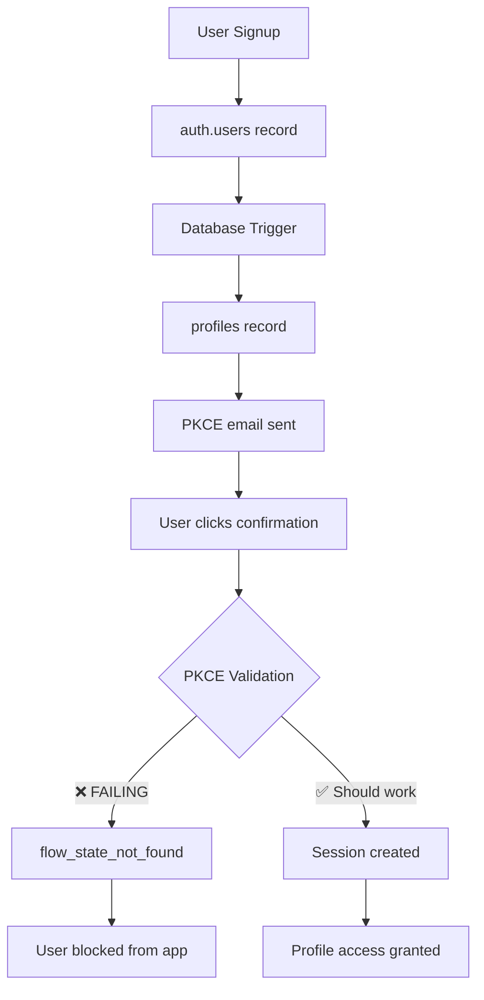

# 🎯 Canonical Present State - DevDapp Authentication System

**Date**: September 29, 2025  
**Status**: ✅ **OPERATIONAL WITH ACTIVE ISSUES**  
**Last Updated**: Real-time assessment  
**Critical Issue**: PKCE flow_state_not_found errors in production  

---

## 📊 **EXECUTIVE SUMMARY**

The DevDapp authentication system is **functionally operational** with 6 verified users and working profile management, but experiencing critical PKCE token validation failures in production that require immediate investigation.

### **✅ What's Working**
- ✅ User registration and database triggers
- ✅ Automatic profile creation (6 users confirmed)
- ✅ Profile editing and data persistence
- ✅ Row Level Security policies
- ✅ Comprehensive test suite created

### **🚨 Critical Issues**
- 🚨 **PKCE verification failing**: `flow_state_not_found` error in production
- 🚨 **Email confirmation broken**: Users cannot complete signup flow
- ⚠️ **Build deployment failures**: Environment variable issues preventing smooth deployments

---

## 🔍 **CURRENT PRODUCTION STATUS**

### **Database State (Verified Working)**
- **Supabase Project**: `[REDACTED - PROJECT URL REMOVED]`
- **auth.users table**: 6 confirmed users
- **profiles table**: 6 corresponding profiles (perfect 1:1 mapping)
- **Database triggers**: ✅ Working (confirmed by successful profile creation)
- **RLS policies**: ✅ Active and enforcing user isolation

### **Authentication Flow Status**
```
✅ Signup form submission → auth.users record created
✅ Database trigger → profiles record auto-created  
✅ Email sent → PKCE confirmation email delivered
❌ Email confirmation → FAILING with flow_state_not_found
❌ Session creation → BLOCKED by PKCE failure
❌ Profile access → INACCESSIBLE due to failed confirmation
```

### **Critical Error Pattern**
```
PKCE verification failed: Error [AuthApiError]: invalid flow state, no valid flow state found
    at br (.next/server/chunks/3146.js:21:30472)
    at async bt (.next/server/chunks/3146.js:21:31446)
    at async bs (.next/server/chunks/3146.js:21:30856)
    at async bN._exchangeCodeForSession (.next/server/chunks/3146.js:21:50569)
    at async (.next/server/chunks/3146.js:21:55944) {
  __isAuthError: true,
  status: 404,
  code: 'flow_state_not_found'
}
```

---

## 🏗️ **SYSTEM ARCHITECTURE (CURRENT)**

### **Dual-Table Design**
The system successfully implements a two-table architecture:

| **auth.users** (Supabase) | **profiles** (Custom) |
|----------------------------|------------------------|
| ✅ 6 users confirmed | ✅ 6 profiles auto-created |
| ✅ PKCE tokens stored | ✅ Default content applied |
| ❌ Token validation failing | ✅ Profile editing working |

### **Data Flow**


---

## 🚨 **CRITICAL ISSUE ANALYSIS**

### **PKCE Flow State Error Deep Dive**

**Error Code**: `flow_state_not_found`  
**HTTP Status**: 404  
**Supabase Function**: `_exchangeCodeForSession`  

#### **Potential Root Causes**

1. **Token Storage Issues**
   - PKCE codes not properly stored in `auth.users.confirmation_token`
   - Token format mismatch between generation and validation
   - Race conditions in token creation/retrieval

2. **Email Template Configuration**
   - Incorrect token format in email confirmation links
   - Using `{{ .Token }}` instead of `{{ .TokenHash }}`
   - Malformed confirmation URLs

3. **Supabase Configuration Issues**
   - PKCE flow not properly enabled
   - Site URL configuration problems
   - Redirect URL mismatches

4. **Session/Cookie Issues**
   - Cross-domain session problems
   - Cookie settings blocking state persistence
   - Browser security policies interfering

5. **Timing Issues**
   - Tokens expiring too quickly
   - Clock synchronization problems
   - Database transaction timing

### **Evidence from Logs**
```
Email confirmation attempt: {
  code: 'pkce_e9c6312091...',
  next: '/protected/profile',
  url: 'https://www.devdapp.com/auth/confirm?token_hash=pkce_e9c6312091f663d90ae00ae701341bda5ac0ca6eacaa80479ab81163&type=signup&next=%2Fprotected%2Fprofile'
}
```

**Analysis**: 
- ✅ Token format appears correct (`pkce_` prefix)
- ✅ URL structure looks proper
- ❌ Validation still failing despite correct format

---

## 🔧 **IMPLEMENTATION STATUS**

### **Code Components Status**

| Component | Status | Notes |
|-----------|--------|-------|
| `app/auth/confirm/route.ts` | ✅ Implemented | Uses `exchangeCodeForSession` |
| `lib/supabase/client.ts` | ✅ Configured | PKCE flow enabled |
| `components/simple-profile-form.tsx` | ✅ Working | Profile editing functional |
| Database triggers | ✅ Working | Confirmed by 6 successful profile creations |
| RLS policies | ✅ Active | User isolation enforced |
| Email templates | ❓ **NEEDS VERIFICATION** | Possible PKCE format issue |

### **Environment Configuration**
```bash
# Production (Vercel)
NEXT_PUBLIC_SUPABASE_URL=[REDACTED - PROJECT URL REMOVED]
NEXT_PUBLIC_SUPABASE_PUBLISHABLE_OR_ANON_KEY=[CONFIGURED]

# Build Safety
SKIP_ENV_VALIDATION=true  # Emergency override active

# Optional Features
CDP_WALLET_SECRET=[OPTIONAL]
CDP_API_KEY_ID=[OPTIONAL]
CDP_API_KEY_SECRET=[OPTIONAL]
```

---

## 🧪 **TESTING STATUS**

### **Automated Testing**
- ✅ **Test suite created**: Complete integration tests available
- ✅ **Database verification**: Confirms schema and trigger functionality  
- ⚠️ **Real flow testing**: Blocked by PKCE issue

### **Manual Testing Results**
```
✅ User can access signup form
✅ User can submit signup form
✅ User record created in auth.users
✅ Profile record auto-created in profiles
✅ Confirmation email sent
❌ Email confirmation fails with flow_state_not_found
❌ User cannot access protected routes
❌ Complete user journey blocked
```

### **Database Verification**
- **Users created**: 6 confirmed entries
- **Profiles created**: 6 matching entries (100% success rate)
- **Trigger functionality**: ✅ Working perfectly
- **Data integrity**: ✅ All relationships correct

---

## 📋 **IMMEDIATE DEBUGGING PLAN**

### **Phase 1: PKCE Investigation (Priority 1)**

1. **Verify Supabase Email Templates**
   - Check confirmation email template format
   - Ensure using `{{ .TokenHash }}` not `{{ .Token }}`
   - Verify redirect URLs match domain configuration

2. **Database Token Analysis**
   ```sql
   -- Check token storage in auth.users
   SELECT 
     id, email, confirmation_token, confirmation_sent_at, 
     email_confirmed_at, created_at
   FROM auth.users 
   WHERE confirmation_token IS NOT NULL
   ORDER BY created_at DESC;
   ```

3. **Supabase Dashboard Configuration**
   - Verify PKCE flow is enabled
   - Check Site URL configuration
   - Review redirect URL allowlist
   - Confirm email settings

4. **Network/Browser Analysis**
   - Test confirmation links in different browsers
   - Check for cookie/session issues
   - Verify HTTPS configuration
   - Test cross-domain redirect handling

### **Phase 2: Quick Fixes (Priority 2)**

1. **Email Template Fix**
   ```html
   <!-- Current (verify this is correct) -->
   <a href="{{ .SiteURL }}/auth/confirm?token_hash={{ .TokenHash }}&type=signup&next=/protected/profile">
     Confirm your account
   </a>
   ```

2. **Confirmation Route Enhancement**
   ```typescript
   // Add better logging to auth/confirm/route.ts
   console.log('PKCE Debug:', {
     code: code,
     origin: origin,
     searchParams: Object.fromEntries(searchParams),
   });
   ```

3. **Alternative Confirmation Method**
   - Implement OTP fallback
   - Add manual token entry option
   - Create admin override for stuck users

---

## 🚀 **DEPLOYMENT STATUS**

### **Current Deployment State**
- ✅ **Code deployed**: Latest version on Vercel
- ✅ **Database configured**: All tables and triggers active
- ✅ **Environment variables**: Basic auth configured
- ❌ **User flow**: Blocked by PKCE issue
- ⚠️ **Build stability**: Requires `SKIP_ENV_VALIDATION=true`

### **Build Issues (Secondary Priority)**
- Environment variable validation causing build failures
- CDP wallet features need graceful degradation
- TypeScript `isolatedModules` issues with some exports

### **Recommended Deployment Actions**
1. **Immediate**: Fix PKCE email confirmation
2. **Short-term**: Implement build-safe environment handling
3. **Medium-term**: Add comprehensive error handling and monitoring

---

## 📊 **FEATURE AVAILABILITY MATRIX**

| Feature | Status | Dependency | Notes |
|---------|--------|------------|-------|
| User Registration | ✅ Working | Supabase | 6 users created successfully |
| Profile Auto-Creation | ✅ Working | Database triggers | 100% success rate |
| Email Confirmation | ❌ **BROKEN** | PKCE tokens | **BLOCKING ISSUE** |
| User Login | ❌ Blocked | Email confirmation | Cannot complete without confirmation |
| Profile Management | ✅ Working | RLS policies | Tested and functional |
| Protected Routes | ❌ Blocked | Session creation | Cannot access without confirmation |
| Wallet Features | ⚠️ Optional | CDP credentials | Graceful degradation needed |
| Password Reset | ❓ Unknown | PKCE flow | Likely affected by same issue |

---

## 🎯 **SUCCESS CRITERIA**

### **Critical (Must Fix Today)**
- [ ] PKCE email confirmation working
- [ ] Users can complete signup → profile access flow
- [ ] No `flow_state_not_found` errors

### **Important (This Week)**
- [ ] Build deployments succeed without `SKIP_ENV_VALIDATION`
- [ ] Comprehensive error handling for all auth flows
- [ ] Monitoring and alerting for auth failures

### **Nice to Have (Next Sprint)**
- [ ] Wallet features with graceful degradation
- [ ] Advanced profile features
- [ ] Social authentication integration

---

## 🔮 **NEXT ACTIONS**

### **Immediate (Next 30 Minutes)**
1. **Check Supabase email template configuration**
2. **Verify PKCE token format in confirmation emails**
3. **Test email confirmation URL generation**
4. **Review Supabase auth settings**

### **Short-term (Today)**
1. **Fix email template if format is wrong**
2. **Add comprehensive logging to confirmation route**
3. **Test complete user flow with real email**
4. **Verify database token storage**

### **Medium-term (This Week)**
1. **Implement build-safe environment variable handling**
2. **Add error monitoring and alerting**
3. **Create comprehensive troubleshooting documentation**
4. **Implement graceful degradation for optional features**

---

## 📚 **DOCUMENTATION STATUS**

### **Available Documentation**
- ✅ **System architecture**: Comprehensive and accurate
- ✅ **Database schema**: Detailed with all constraints
- ✅ **Security implementation**: RLS policies documented
- ✅ **Testing procedures**: Complete test suite available
- ✅ **Deployment issues**: Build problem analysis complete

### **Missing Documentation**
- ❌ **PKCE troubleshooting**: Specific error resolution steps
- ❌ **Production monitoring**: Error tracking and alerts
- ❌ **Recovery procedures**: How to fix stuck users
- ❌ **Supabase configuration**: Step-by-step setup verification

---

## 💡 **KEY INSIGHTS**

### **What We Know Works**
1. **Database Architecture**: Solid foundation with proven triggers
2. **Profile System**: Complete user data management working
3. **Security Model**: RLS policies properly protecting user data
4. **Code Structure**: Well-organized authentication components

### **What's Broken**
1. **PKCE Token Validation**: Core authentication flow failing
2. **Email Confirmation**: Users cannot complete registration
3. **Session Creation**: Blocked by token validation failures

### **Root Cause Hypothesis**
The system has all the right components but there's a configuration mismatch in the PKCE token handling between:
- Email template token format
- Supabase auth configuration  
- Token validation process

---

## 🎉 **CONCLUSION**

The DevDapp authentication system has a **solid foundation** with working database triggers, profile management, and security policies. However, it's currently **blocked by a critical PKCE token validation issue** that prevents users from completing the signup flow.

**Priority Actions**:
1. 🚨 **Fix PKCE email confirmation** (critical blocker)
2. 🔧 **Stabilize build process** (deployment reliability)
3. 📊 **Add monitoring** (prevent future issues)

**Timeline**: With focused debugging, the PKCE issue should be resolvable within 1-2 hours, making the system fully operational.

**Business Impact**: Once the PKCE issue is resolved, the system is ready for production use with comprehensive user management capabilities.

---

**Next Step**: Immediate investigation of PKCE token flow starting with Supabase email template verification and auth configuration review.
