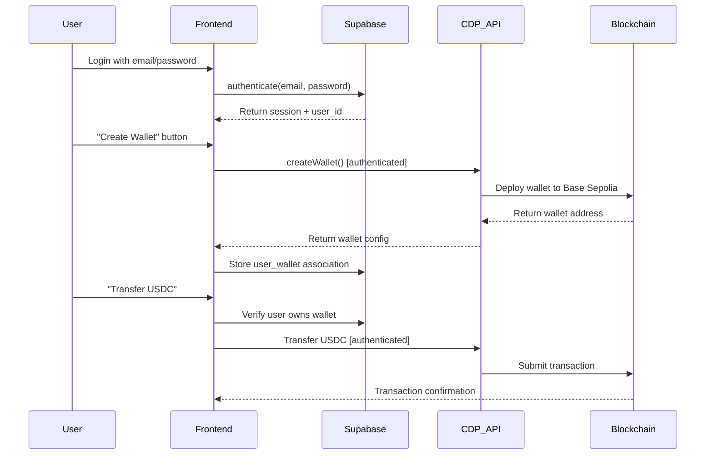

# 🔐 Supabase Authentication + Coinbase CDP Wallet Integration Analysis

**Date**: September 23, 2025  
**Status**: 📋 **COMPREHENSIVE ANALYSIS** - Integration Patterns & Security Framework  
**Purpose**: Document how Supabase authentication can control Coinbase CDP wallets without breaking existing functionality

---

## 🎯 Executive Summary

This analysis explores the integration between **Supabase authentication** and **Coinbase CDP (Coinbase Developer Platform) wallets**, demonstrating how users can log in with Supabase credentials to create, manage, and control CDP wallets. The goal is to create a unified authentication experience where:

1. **Supabase handles user identity** (email/password authentication)
2. **CDP provides wallet infrastructure** (blockchain account creation/management)  
3. **Both systems work together** without conflicts or breaking changes

### Key Integration Patterns
- **Primary Authentication**: Supabase for user login/session management
- **Wallet Management**: CDP for blockchain account creation and transactions
- **Data Association**: Link Supabase user IDs to CDP wallet addresses in database
- **Security Layer**: Use Supabase RLS policies to secure wallet operations

---

## 🏗️ Current Architecture Analysis

### Supabase Authentication System (✅ Fully Implemented)

#### **Authentication Flow**
```typescript
// Current Supabase auth implementation
1. User Registration: email/password → Supabase auth.users table
2. Email Confirmation: Required for account activation
3. Session Management: JWT tokens with automatic refresh
4. Profile Creation: Automatic via database trigger
5. Protected Routes: Middleware-based access control
```

#### **Database Schema**
```sql
-- Current profiles table
CREATE TABLE profiles (
  id UUID REFERENCES auth.users(id) PRIMARY KEY,
  username TEXT UNIQUE,
  avatar_url TEXT,
  about_me TEXT,
  updated_at TIMESTAMP WITH TIME ZONE DEFAULT NOW(),
  created_at TIMESTAMP WITH TIME ZONE DEFAULT NOW()
);

-- Row Level Security enforced
ALTER TABLE profiles ENABLE ROW LEVEL SECURITY;
CREATE POLICY "Users can view own profile" ON profiles FOR SELECT USING (auth.uid() = id);
```

#### **Security Features**
- ✅ **Row Level Security (RLS)**: Users can only access their own data
- ✅ **JWT Token Authentication**: Secure session management
- ✅ **Email Verification**: Required for account activation
- ✅ **Password Reset**: Secure reset flow via email
- ✅ **Middleware Protection**: Routes protected server-side

### Coinbase CDP Wallet System (✅ Partially Implemented)

#### **Wallet Operations**
```typescript
// Current CDP implementation
1. Wallet Creation: CDP API creates blockchain accounts
2. Balance Checking: Query Base Sepolia network for balances
3. Funding: Testnet faucet integration (USDC/ETH)
4. Transfers: USDC transfers between wallets
5. Address Management: Track wallet addresses and metadata
```

#### **API Endpoints**
```
GET  /api/wallet/list     - List all CDP wallets
POST /api/wallet/create   - Create new CDP wallet
POST /api/wallet/fund     - Fund wallet from testnet faucet
POST /api/wallet/transfer - Transfer USDC between wallets
GET  /api/wallet/balance  - Get wallet balances
```

#### **Current Limitations**
- ❌ **No User Association**: Wallets not linked to specific Supabase users
- ❌ **Global Access**: Any user can see all wallets
- ❌ **No Permission System**: No user-specific wallet controls
- ❌ **No Persistence**: Wallet metadata not stored in Supabase

---

## 🔗 Integration Architecture: "Login with Supabase to Control CDP Wallets"

### Unified Authentication Flow



### Database Schema Enhancement

```sql
-- Enhanced schema for Supabase + CDP integration
-- Table 1: User wallets (links Supabase users to CDP wallets)
CREATE TABLE user_wallets (
  id UUID DEFAULT gen_random_uuid() PRIMARY KEY,
  user_id UUID REFERENCES auth.users(id) ON DELETE CASCADE,
  wallet_address TEXT NOT NULL UNIQUE,
  wallet_name TEXT NOT NULL,
  wallet_type TEXT NOT NULL DEFAULT 'personal', -- 'personal', 'business', 'trading'
  network TEXT NOT NULL DEFAULT 'base-sepolia',
  created_at TIMESTAMP WITH TIME ZONE DEFAULT NOW(),
  updated_at TIMESTAMP WITH TIME ZONE DEFAULT NOW(),
  is_active BOOLEAN DEFAULT true,
  
  -- Metadata
  last_balance_check TIMESTAMP WITH TIME ZONE,
  estimated_balance_usdc DECIMAL(15,6) DEFAULT 0,
  estimated_balance_eth DECIMAL(18,18) DEFAULT 0
);

-- Table 2: Wallet operations log
CREATE TABLE wallet_operations (
  id UUID DEFAULT gen_random_uuid() PRIMARY KEY,
  user_id UUID REFERENCES auth.users(id) ON DELETE CASCADE,
  wallet_address TEXT NOT NULL,
  operation_type TEXT NOT NULL, -- 'create', 'fund', 'transfer', 'balance_check'
  transaction_hash TEXT,
  amount DECIMAL(18,6),
  token_type TEXT, -- 'usdc', 'eth'
  status TEXT NOT NULL DEFAULT 'pending', -- 'pending', 'success', 'failed'
  error_message TEXT,
  created_at TIMESTAMP WITH TIME ZONE DEFAULT NOW(),
  completed_at TIMESTAMP WITH TIME ZONE
);

-- Table 3: User preferences for wallet features
CREATE TABLE user_wallet_preferences (
  user_id UUID REFERENCES auth.users(id) PRIMARY KEY,
  default_network TEXT DEFAULT 'base-sepolia',
  auto_fund_enabled BOOLEAN DEFAULT false,
  notification_preferences JSONB DEFAULT '{}',
  created_at TIMESTAMP WITH TIME ZONE DEFAULT NOW(),
  updated_at TIMESTAMP WITH TIME ZONE DEFAULT NOW()
);

-- Enable RLS on all tables
ALTER TABLE user_wallets ENABLE ROW LEVEL SECURITY;
ALTER TABLE wallet_operations ENABLE ROW LEVEL SECURITY;
ALTER TABLE user_wallet_preferences ENABLE ROW LEVEL SECURITY;

-- RLS Policies: Users can only access their own data
CREATE POLICY "Users can manage own wallets" ON user_wallets
  FOR ALL USING (auth.uid() = user_id);

CREATE POLICY "Users can view own operations" ON wallet_operations
  FOR SELECT USING (auth.uid() = user_id);

CREATE POLICY "Users can manage own preferences" ON user_wallet_preferences
  FOR ALL USING (auth.uid() = user_id);

-- Admin policies (for future admin features)
CREATE POLICY "Admins can view all wallets" ON user_wallets
  FOR SELECT USING (
    EXISTS (
      SELECT 1 FROM profiles 
      WHERE id = auth.uid() AND (username LIKE '%admin%' OR about_me LIKE '%admin%')
    )
  );
```

### Enhanced API Layer

```typescript
// Enhanced wallet API with Supabase authentication
// /app/api/wallet/create/route.ts
import { createClient } from '@/lib/supabase/server';

export async function POST(request: NextRequest) {
  try {
    // 1. Authenticate user with Supabase
    const supabase = await createClient();
    const { data: { user }, error: authError } = await supabase.auth.getUser();
    
    if (authError || !user) {
      return NextResponse.json(
        { error: 'Authentication required' },
        { status: 401 }
      );
    }

    // 2. Create CDP wallet
    const { name, type } = await request.json();
    const cdp = getCdpClient();
    const account = await cdp.evm.getOrCreateAccount({ name });

    // 3. Store wallet association in Supabase
    const { data: walletData, error: dbError } = await supabase
      .from('user_wallets')
      .insert({
        user_id: user.id,
        wallet_address: account.address,
        wallet_name: name,
        wallet_type: type
      })
      .select()
      .single();

    if (dbError) {
      console.error('Database error:', dbError);
      return NextResponse.json(
        { error: 'Failed to save wallet' },
        { status: 500 }
      );
    }

    // 4. Log the operation
    await supabase.from('wallet_operations').insert({
      user_id: user.id,
      wallet_address: account.address,
      operation_type: 'create',
      status: 'success'
    });

    return NextResponse.json({
      address: account.address,
      name,
      type,
      id: walletData.id
    });

  } catch (error) {
    console.error('Wallet creation error:', error);
    return NextResponse.json(
      { error: 'Failed to create wallet' },
      { status: 500 }
    );
  }
}
```

### Frontend Integration Pattern

```typescript
// Enhanced wallet management component
// /components/wallet/AuthenticatedWalletManager.tsx
'use client';

import { useEffect, useState } from 'react';
import { createClient } from '@/lib/supabase/client';
import { useRouter } from 'next/navigation';

interface UserWallet {
  id: string;
  wallet_address: string;
  wallet_name: string;
  wallet_type: string;
  estimated_balance_usdc: number;
  estimated_balance_eth: number;
  created_at: string;
}

export function AuthenticatedWalletManager() {
  const [user, setUser] = useState(null);
  const [wallets, setWallets] = useState<UserWallet[]>([]);
  const [loading, setLoading] = useState(true);
  const router = useRouter();
  const supabase = createClient();

  useEffect(() => {
    // Check authentication
    const checkAuth = async () => {
      const { data: { user }, error } = await supabase.auth.getUser();
      
      if (error || !user) {
        router.push('/auth/login');
        return;
      }
      
      setUser(user);
      await loadUserWallets(user.id);
    };

    checkAuth();
  }, []);

  const loadUserWallets = async (userId: string) => {
    try {
      const { data, error } = await supabase
        .from('user_wallets')
        .select('*')
        .eq('user_id', userId)
        .eq('is_active', true)
        .order('created_at', { ascending: false });

      if (error) throw error;
      setWallets(data || []);
    } catch (error) {
      console.error('Error loading wallets:', error);
    } finally {
      setLoading(false);
    }
  };

  const createWallet = async (name: string, type: string) => {
    try {
      const response = await fetch('/api/wallet/create', {
        method: 'POST',
        headers: { 'Content-Type': 'application/json' },
        body: JSON.stringify({ name, type })
      });

      if (!response.ok) throw new Error('Failed to create wallet');
      
      const newWallet = await response.json();
      await loadUserWallets(user.id); // Refresh list
      
      return newWallet;
    } catch (error) {
      console.error('Error creating wallet:', error);
      throw error;
    }
  };

  if (loading) return <div>Loading wallets...</div>;
  if (!user) return <div>Please log in to access wallets</div>;

  return (
    <div className="space-y-6">
      <div className="flex justify-between items-center">
        <h2 className="text-2xl font-bold">My Wallets</h2>
        <button 
          onClick={() => createWallet(`Wallet ${wallets.length + 1}`, 'personal')}
          className="btn-primary"
        >
          Create New Wallet
        </button>
      </div>

      <div className="grid gap-4">
        {wallets.map(wallet => (
          <div key={wallet.id} className="card p-4">
            <h3 className="font-semibold">{wallet.wallet_name}</h3>
            <p className="text-sm text-gray-600">{wallet.wallet_address}</p>
            <div className="mt-2">
              <span>USDC: {wallet.estimated_balance_usdc}</span>
              <span className="ml-4">ETH: {wallet.estimated_balance_eth}</span>
            </div>
          </div>
        ))}
      </div>
    </div>
  );
}
```

---

## 🛡️ Security Framework & Best Practices

### Authentication Security

#### **Multi-Layer Security Model**
```typescript
// Security layers in order of execution
1. Next.js Middleware: Route-level authentication
2. Supabase JWT Validation: Token verification
3. Row Level Security: Database-level access control
4. API Endpoint Guards: Function-level permission checks
5. CDP API Keys: Server-side only, never exposed to client
```

#### **Sensitive Data Protection**
```bash
# Environment variable security checklist
✅ CDP_API_KEY_SECRET - Server-side only, never in client code
✅ CDP_WALLET_SECRET - Server-side only, used for wallet signing
✅ SUPABASE_SERVICE_ROLE_KEY - Admin operations only
✅ NEXT_PUBLIC_* variables - Only non-sensitive data
✅ All secrets stored in Vercel environment variables
```

### Wallet Security Considerations

#### **Private Key Management**
- ✅ **CDP Manages Private Keys**: Never stored in application database
- ✅ **Server-Side Signing**: All transactions signed on backend
- ✅ **No Client Exposure**: Private keys never sent to frontend
- ✅ **Coinbase Security**: Leverages enterprise-grade CDP infrastructure

#### **Transaction Security**
```typescript
// Secure transaction flow
1. User authenticates with Supabase
2. Frontend requests transaction with user context
3. Backend verifies user owns source wallet (RLS check)
4. Backend validates transaction parameters
5. CDP signs transaction with managed private key
6. Transaction submitted to blockchain
7. Result logged in audit trail
```

#### **Access Control Matrix**
```typescript
interface PermissionMatrix {
  unauthenticated_user: {
    can_view: [];
    can_create: [];
    can_modify: [];
    can_delete: [];
  };
  authenticated_user: {
    can_view: ['own_wallets', 'own_transactions', 'own_profile'];
    can_create: ['wallets', 'transactions'];
    can_modify: ['own_wallet_names', 'own_preferences'];
    can_delete: ['own_wallets']; // soft delete only
  };
  admin_user: {
    inherits: 'authenticated_user';
    can_view: ['all_wallets', 'system_stats', 'audit_logs'];
    can_modify: ['wallet_limits', 'feature_flags'];
    can_delete: ['any_wallet']; // with audit trail
  };
}
```

### Data Privacy & Compliance

#### **PII (Personally Identifiable Information) Handling**
- ✅ **Email Addresses**: Stored in Supabase auth.users (encrypted at rest)
- ✅ **Wallet Addresses**: Public blockchain data, safe to store
- ✅ **Transaction History**: Linked to user ID with RLS protection
- ✅ **User Preferences**: Stored with proper access controls

#### **GDPR Compliance Patterns**
```sql
-- Data deletion procedures for compliance
-- 1. Soft delete user wallets
UPDATE user_wallets SET is_active = false, deleted_at = NOW() 
WHERE user_id = $1;

-- 2. Anonymize operation logs
UPDATE wallet_operations 
SET user_id = NULL, anonymized_at = NOW()
WHERE user_id = $1;

-- 3. Supabase handles auth.users deletion automatically
```

---

## 🚀 Implementation Roadmap

### Phase 1: Database Foundation (1-2 days)
```sql
-- Create enhanced schema
1. Create user_wallets table
2. Create wallet_operations table  
3. Create user_wallet_preferences table
4. Set up RLS policies
5. Create audit triggers
```

### Phase 2: API Enhancement (2-3 days)
```typescript
// Enhance existing API endpoints
1. Add Supabase authentication to all wallet APIs
2. Implement user-wallet association logic
3. Add operation logging
4. Update error handling for auth failures
```

### Phase 3: Frontend Integration (2-3 days)
```typescript
// Update wallet management components
1. Add authentication checks to wallet components
2. Filter wallets by authenticated user
3. Update wallet creation flow
4. Add user-specific wallet preferences
```

### Phase 4: Security Hardening (1-2 days)
```bash
# Security implementation
1. Add rate limiting to wallet operations
2. Implement transaction limits
3. Add audit logging for sensitive operations
4. Set up monitoring for unusual activity
```

### Phase 5: Testing & Documentation (1-2 days)
```typescript
// Comprehensive testing
1. Test authentication flows
2. Test wallet isolation between users
3. Test permission boundaries
4. Update documentation
```

---

## 🔧 Migration Strategy: Zero Breaking Changes

### Backward Compatibility Approach
```typescript
// Feature flag pattern for gradual rollout
export function getWalletAccessMode(): 'legacy' | 'authenticated' {
  const user = getCurrentUser();
  const isAuthEnabled = process.env.NEXT_PUBLIC_ENABLE_AUTH_WALLETS === 'true';
  
  if (!isAuthEnabled || !user) {
    return 'legacy'; // Current behavior: all wallets visible
  }
  
  return 'authenticated'; // New behavior: user-scoped wallets
}

// Dual-mode API endpoints
export async function GET(request: NextRequest) {
  const mode = getWalletAccessMode();
  
  if (mode === 'legacy') {
    // Return all wallets (current behavior)
    return getLegacyWallets();
  } else {
    // Return user-specific wallets (new behavior)
    return getAuthenticatedUserWallets(request);
  }
}
```

### Feature Flag Configuration
```bash
# Environment variables for controlled rollout
NEXT_PUBLIC_ENABLE_AUTH_WALLETS=false     # Start disabled
NEXT_PUBLIC_REQUIRE_AUTH_FOR_WALLETS=false # Gradual enforcement
NEXT_PUBLIC_WALLET_AUTH_MODE=optional      # optional|required
```

### Migration Timeline
```
Week 1: Implement dual-mode system (auth + legacy)
Week 2: Test with feature flags disabled
Week 3: Enable for admin users only
Week 4: Gradual rollout to all users
Week 5: Full deployment with legacy fallback
```

---

## 📊 Integration Benefits

### User Experience Improvements
- ✅ **Personalized Wallets**: Each user sees only their wallets
- ✅ **Persistent Storage**: Wallet data survives browser refresh
- ✅ **Cross-Device Access**: Login from any device to access wallets
- ✅ **Audit History**: Complete transaction history per user
- ✅ **Secure Backup**: Wallet metadata safely stored in Supabase

### Developer Benefits
- ✅ **Unified Authentication**: Single auth system for entire app
- ✅ **Scalable Architecture**: Database-backed wallet management
- ✅ **Audit Compliance**: Complete operation logging
- ✅ **Fine-Grained Permissions**: User-level access control
- ✅ **Enterprise Ready**: Supports multi-tenant architecture

### Security Improvements
- ✅ **Data Isolation**: RLS prevents data leakage between users
- ✅ **Session Management**: Secure JWT-based authentication
- ✅ **Operation Logging**: Complete audit trail for compliance
- ✅ **Access Control**: Role-based permissions system
- ✅ **Privacy Protection**: Users control their own wallet data

---

## 🚨 Risk Assessment & Mitigation

### Technical Risks
| Risk | Impact | Probability | Mitigation |
|------|--------|-------------|------------|
| **Database Schema Changes** | High | Low | Use migrations and feature flags |
| **API Breaking Changes** | High | Low | Implement dual-mode compatibility |
| **Authentication Failures** | Medium | Medium | Graceful fallback to legacy mode |
| **Performance Impact** | Medium | Low | Optimize queries with proper indexing |
| **Data Migration Issues** | High | Low | Extensive testing with rollback plan |

### Security Risks
| Risk | Impact | Probability | Mitigation |
|------|--------|-------------|------------|
| **RLS Policy Bypass** | Critical | Very Low | Code review + automated testing |
| **CDP API Key Exposure** | Critical | Low | Server-side only, environment vars |
| **Session Hijacking** | High | Low | JWT rotation + secure headers |
| **Data Leak Between Users** | Critical | Very Low | RLS + comprehensive testing |
| **Unauthorized Wallet Access** | High | Low | Multi-layer authentication checks |

### Business Risks
| Risk | Impact | Probability | Mitigation |
|------|--------|-------------|------------|
| **User Adoption Resistance** | Medium | Medium | Gradual rollout + user education |
| **Increased Complexity** | Medium | High | Comprehensive documentation |
| **Maintenance Overhead** | Medium | Medium | Automated testing + monitoring |
| **Feature Development Slowdown** | Low | Medium | Clear architecture + standards |

---

## 📋 Success Metrics & Monitoring

### Key Performance Indicators
```typescript
// Metrics to track post-implementation
interface IntegrationMetrics {
  authentication: {
    login_success_rate: number;        // Target: >99%
    session_duration_avg: number;      // Target: >30min
    auth_error_rate: number;           // Target: <1%
  };
  wallet_operations: {
    wallet_creation_success_rate: number;  // Target: >95%
    transaction_success_rate: number;      // Target: >90%
    api_response_time_p95: number;          // Target: <2s
  };
  user_experience: {
    wallet_access_time: number;             // Target: <5s
    user_satisfaction_score: number;       // Target: >4.5/5
    support_ticket_volume: number;         // Target: <10/month
  };
}
```

### Monitoring & Alerting
```typescript
// Essential monitoring setup
1. Database Performance: Query execution time, connection pool usage
2. Authentication Health: Login success rates, token refresh errors
3. API Endpoint Monitoring: Response times, error rates, rate limits
4. Security Alerts: Failed auth attempts, permission violations
5. User Activity: Wallet operations, transaction volumes, error patterns
```

---

## 🎯 Conclusion

The integration of **Supabase authentication with Coinbase CDP wallets** creates a powerful, secure, and user-friendly Web3 application architecture. By combining Supabase's robust authentication and database capabilities with CDP's enterprise-grade wallet infrastructure, we achieve:

### Core Value Proposition
- **Seamless User Experience**: Single login provides access to both Web2 profile management and Web3 wallet operations
- **Enterprise Security**: Multi-layer security with RLS, JWT tokens, and server-side private key management  
- **Scalable Architecture**: Database-backed wallet management that scales from prototype to production
- **Zero Breaking Changes**: Backward-compatible implementation with gradual feature rollout

### Technical Excellence
- **Clean Separation of Concerns**: Supabase handles identity, CDP handles blockchain operations
- **Comprehensive Security Model**: Defense in depth with authentication, authorization, and audit logging
- **Developer-Friendly APIs**: Consistent patterns across all wallet operations
- **Production-Ready Design**: Built for scale, monitoring, and maintenance

This integration pattern establishes a foundation for building sophisticated Web3 applications that combine the best of traditional web authentication with cutting-edge blockchain technology, while maintaining the highest standards of security and user experience.

